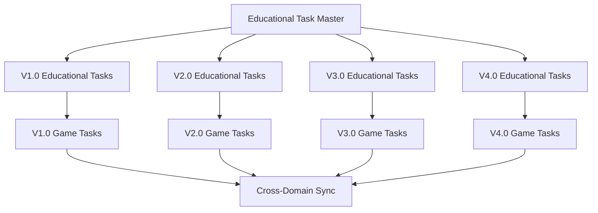
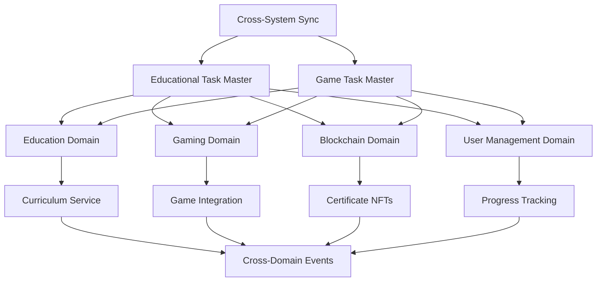

# 📚 Educational Task Master - Engineering Forge

**Versão**: 1.0  
**Data**: Janeiro 2025  
**Status**: 🚀 **ATIVO**

---

## 🎯 **Visão Geral**

O **Educational Task Master** é o sistema central de gerenciamento de tarefas para o
desenvolvimento educacional do Engineering Forge. Este documento serve como o ponto de
sincronização principal entre todas as versões, domínios e fases de desenvolvimento
educacional.

### **Objetivo**

- **Sincronizar** todas as tarefas educacionais entre versões
- **Padronizar** metodologia de desenvolvimento educacional
- **Coordenar** integração com domínio de jogos
- **Garantir** qualidade e consistência educacional
- **Facilitar** planejamento e execução de sprints

### **Filosofia de Desenvolvimento**

- **Education-First Approach**: Toda tarefa deve considerar o aprendizado do usuário
- **Iterative Development**: Desenvolvimento em ciclos curtos com feedback
- **Gamification Integration**: Integração natural com mecânicas de jogo
- **Blockchain Ready**: Preparação para certificados NFT
- **Scalable Architecture**: Suporte para crescimento e evolução

---

## 🏗️ **Arquitetura do Sistema**

### **Hierarquia de Tarefas**

```
EPIC (Épico)
├── FEATURE (Feature)
│   ├── TASK (Tarefa)
│   │   ├── SUBTASK (Subtarefa)
│   │   └── MICROTASK (Microtarefa)
```

### **Categorização de Tarefas**

#### **📚 Educational Development Tasks**

- **CURRICULUM**: Desenvolvimento de currículo
- **LESSONS**: Sistema de lições
- **ASSESSMENTS**: Sistema de avaliações
- **PROGRESS**: Acompanhamento de progresso
- **CERTIFICATES**: Sistema de certificados

#### **🔧 Technical Tasks**

- **ARCHITECTURE**: Arquitetura educacional
- **INTEGRATION**: Integração com outros domínios
- **PERFORMANCE**: Otimização de performance
- **SECURITY**: Segurança educacional

#### **📖 Content Tasks**

- **DESIGN**: Design de conteúdo
- **MULTIMEDIA**: Recursos multimídia
- **INTERACTIVITY**: Elementos interativos
- **ACCESSIBILITY**: Acessibilidade

#### **🧪 Quality Tasks**

- **TESTING**: Testes educacionais
- **QA**: Garantia de qualidade
- **VALIDATION**: Validação pedagógica
- **FEEDBACK**: Sistema de feedback

### **Por Complexidade**

- **🔴 CRITICAL**: Crítico para funcionamento educacional
- **🟡 IMPORTANT**: Importante para experiência completa
- **🟢 NICE-TO-HAVE**: Melhoria de experiência
- **🔵 FUTURE**: Para versões futuras

### **Por Fase de Desenvolvimento**

- **PRE-PRODUCTION**: Planejamento e prototipagem
- **PRODUCTION**: Desenvolvimento principal
- **ALPHA**: Primeira versão educacional
- **BETA**: Versão quase final
- **GOLD**: Versão final
- **POST-LAUNCH**: Manutenção e melhorias

### **Por Risco**

- **🔴 HIGH RISK**: Alto risco técnico ou pedagógico
- **🟡 MEDIUM RISK**: Risco médio
- **🟢 LOW RISK**: Risco baixo
- **⚪ NO RISK**: Sem risco identificado

---

## 🎓 **Educational Development Lifecycle**

```
CONCEPT → PRE-PRODUCTION → PRODUCTION → ALPHA → BETA → GOLD → POST-LAUNCH
```

### **Fases Detalhadas**

#### **1. CONCEPT (Conceito)**

- **Duração**: 2-4 semanas
- **Objetivo**: Definir conceito educacional e visão
- **Entregáveis**: Documento de conceito, objetivos de aprendizado
- **Critérios**: Conceito aprovado por stakeholders educacionais

#### **2. PRE-PRODUCTION (Pré-produção)**

- **Duração**: 4-8 semanas
- **Objetivo**: Planejar e prototipar conteúdo educacional
- **Entregáveis**: Protótipos, storyboards, estrutura de curso
- **Critérios**: Protótipos funcionais e validação pedagógica

#### **3. PRODUCTION (Produção)**

- **Duração**: 12-24 semanas
- **Objetivo**: Desenvolver o conteúdo educacional
- **Entregáveis**: Lições completas, avaliações, projetos
- **Critérios**: Conteúdo completo e testado

#### **4. ALPHA (Alpha)**

- **Duração**: 4-6 semanas
- **Objetivo**: Primeira versão educacional funcional
- **Entregáveis**: Curso completo básico
- **Critérios**: Funcionalidade básica validada

#### **5. BETA (Beta)**

- **Duração**: 6-8 semanas
- **Objetivo**: Versão educacional quase final
- **Entregáveis**: Curso polido com feedback
- **Critérios**: Qualidade educacional validada

#### **6. GOLD (Gold)**

- **Duração**: 2-4 semanas
- **Objetivo**: Versão educacional final
- **Entregáveis**: Curso final e certificados
- **Critérios**: Pronto para lançamento

#### **7. POST-LAUNCH (Pós-lançamento)**

- **Duração**: Contínuo
- **Objetivo**: Manutenção e melhorias educacionais
- **Entregáveis**: Atualizações, novos cursos
- **Critérios**: Melhoria contínua baseada em feedback

---

## 📋 **Templates de Tarefas**

### **Template: Educational Task**

```markdown
# [TASK-EDU-XXX] [Nome da Feature Educacional]

## 📋 Informações da Tarefa

- **ID**: TASK-EDU-XXX
- **Categoria**: Educational
- **Versão**: [V1.0 | V2.0 | V3.0 | V4.0]
- **Prioridade**: [CRITICAL | IMPORTANT | NICE-TO-HAVE | FUTURE]
- **Responsável**: [Nome]
- **Data de Início**: [DD/MM/YYYY]
- **Prazo**: [DD/MM/YYYY]
- **Estimativa**: [X horas]

## 🎯 Objetivo

[Descrição clara do que a feature educacional deve fazer]

## 📚 Especificações Educacionais

- **Objetivo de Aprendizado**: [O que o usuário deve aprender]
- **Metodologia**: [Como será ensinado]
- **Interatividade**: [Nível de interação]
- **Avaliação**: [Como será avaliado]
- **Feedback**: [Sistema de feedback]

## 🛠️ Especificações Técnicas

- **Arquivos Afetados**: [Lista de arquivos]
- **Dependências**: [Outras tarefas necessárias]
- **Integração**: [Integração com outros domínios]
- **Performance**: [Requisitos de performance]

## 🧪 Critérios de Aceitação

- [ ] Feature funciona conforme especificado
- [ ] Objetivos de aprendizado atingidos
- [ ] Performance atende aos requisitos
- [ ] Integração com outros domínios funciona
- [ ] Testes passam
- [ ] Documentação atualizada

## 🎯 Subtarefas

1. **Análise e Design** (X horas)
   - [ ] Analisar requisitos educacionais
   - [ ] Definir objetivos de aprendizado
   - [ ] Criar estrutura de conteúdo
   - [ ] Validar com stakeholders

2. **Desenvolvimento** (X horas)
   - [ ] Implementar funcionalidade
   - [ ] Criar conteúdo educacional
   - [ ] Integrar com sistema
   - [ ] Testes básicos

3. **Validação** (X horas)
   - [ ] Testes educacionais
   - [ ] Validação pedagógica
   - [ ] Feedback de usuários
   - [ ] Ajustes finais

## 📊 Métricas de Sucesso

- **Educacional**: [Métricas de aprendizado]
- **Técnica**: [Métricas técnicas]
- **Usabilidade**: [Métricas de usabilidade]
- **Engajamento**: [Métricas de engajamento]

## 🔄 Dependências

- **Bloqueia**: [Tarefas que dependem desta]
- **Depende de**: [Tarefas necessárias]
- **Integra com**: [Outras features educacionais]

## 📝 Notas

[Notas adicionais, considerações especiais, etc.]
```

### **Template: Content Task**

```markdown
# [TASK-CONTENT-XXX] [Nome do Conteúdo]

## 📋 Informações da Tarefa

- **ID**: TASK-CONTENT-XXX
- **Categoria**: Content
- **Versão**: [V1.0 | V2.0 | V3.0 | V4.0]
- **Prioridade**: [CRITICAL | IMPORTANT | NICE-TO-HAVE | FUTURE]
- **Responsável**: [Nome]
- **Data de Início**: [DD/MM/YYYY]
- **Prazo**: [DD/MM/YYYY]
- **Estimativa**: [X horas]

## 🎯 Objetivo

[Descrição clara do conteúdo a ser criado]

## 📖 Especificações de Conteúdo

- **Tipo de Conteúdo**: [Video | Texto | Interativo | Quiz]
- **Duração**: [Tempo estimado]
- **Nível**: [Iniciante | Intermediário | Avançado]
- **Objetivos**: [Objetivos de aprendizado]
- **Recursos**: [Recursos necessários]

## 🛠️ Especificações Técnicas

- **Formato**: [Formato do conteúdo]
- **Plataforma**: [Onde será usado]
- **Integração**: [Como se integra]
- **Acessibilidade**: [Requisitos de acessibilidade]

## 🧪 Critérios de Aceitação

- [ ] Conteúdo criado conforme especificado
- [ ] Objetivos de aprendizado claros
- [ ] Qualidade educacional validada
- [ ] Acessibilidade garantida
- [ ] Integração funcionando

## 🎯 Subtarefas

1. **Planejamento** (X horas)
   - [ ] Definir estrutura
   - [ ] Criar storyboard
   - [ ] Validar objetivos
   - [ ] Aprovar conceito

2. **Criação** (X horas)
   - [ ] Criar conteúdo
   - [ ] Revisar qualidade
   - [ ] Testar funcionalidade
   - [ ] Ajustar conforme necessário

3. **Finalização** (X horas)
   - [ ] Revisão final
   - [ ] Validação pedagógica
   - [ ] Integração no sistema
   - [ ] Testes finais

## 📊 Métricas de Sucesso

- **Qualidade**: [Métricas de qualidade]
- **Engajamento**: [Métricas de engajamento]
- **Aprendizado**: [Métricas de aprendizado]
- **Satisfação**: [Métricas de satisfação]

## 🔄 Dependências

- **Bloqueia**: [Tarefas que dependem desta]
- **Depende de**: [Tarefas necessárias]
- **Integra com**: [Outros conteúdos]

## 📝 Notas

[Notas adicionais, considerações especiais, etc.]
```

---

## 🔄 **Sistema de Sincronização**

### **Sincronização Entre Versões**



### **Sincronização Entre Domínios**



### **Comandos de Sincronização**

```bash
# Sincronizar todas as versões
@ai sync-all-educational-versions

# Sincronizar versão específica
@ai sync-educational-version V1.0

# Sincronizar com domínio de jogos
@ai sync-educational-gaming V1.0

# Sincronizar com sistema de jogos
@ai sync-educational-gaming

# Validar dependências educacionais
@ai validate-educational-dependencies

# Validar dependências de jogos
@ai validate-dependencies

# Atualizar métricas educacionais
@ai update-educational-metrics

# Atualizar métricas de jogos
@ai update-metrics all
```

---

## 📊 **Métricas e KPIs**

### **Métricas de Desenvolvimento**

- **Velocity**: Story points por sprint
- **Burndown**: Progresso do sprint
- **Quality**: Bugs por feature
- **Coverage**: Cobertura de testes

### **Métricas Educacionais**

- **Learning Effectiveness**: Efetividade do aprendizado
- **Content Quality**: Qualidade do conteúdo
- **User Engagement**: Engajamento do usuário
- **Completion Rate**: Taxa de conclusão

### **Métricas de Qualidade**

- **Pedagogical Validation**: Validação pedagógica
- **Content Accuracy**: Precisão do conteúdo
- **Accessibility**: Acessibilidade
- **User Satisfaction**: Satisfação do usuário

---

## 🛠️ **Workflow de Desenvolvimento**

### **1. Planejamento**

```bash
@ai create-educational-epic [nome] [descrição]
@ai create-educational-feature [epic] [nome] [descrição]
@ai create-educational-task [feature] [nome] [descrição]
```

### **2. Desenvolvimento**

```bash
@ai start-educational-task [task-id]
@ai update-educational-progress [task-id] [progress]
@ai add-educational-subtask [task-id] [nome] [descrição]
```

### **3. Validação**

```bash
@ai validate-educational-content [task-id]
@ai test-educational-feature [task-id]
@ai review-educational-quality [task-id]
```

### **4. Finalização**

```bash
@ai complete-educational-task [task-id] [notas]
@ai sync-educational-version [version]
@ai update-educational-metrics
```

---

## 🚪 **Quality Gates**

### **Gate 1: Educational Design Approval**

- [ ] Design educacional aprovado por stakeholders
- [ ] Objetivos de aprendizado definidos
- [ ] Metodologia validada
- [ ] Protótipo educacional funcional

### **Gate 2: Content Implementation Complete**

- [ ] Conteúdo implementado
- [ ] Testes educacionais passando
- [ ] Validação pedagógica concluída
- [ ] Integração com sistema funcionando

### **Gate 3: Educational Integration Ready**

- [ ] Integração com domínio de jogos
- [ ] Testes de integração passando
- [ ] Performance educacional validada
- [ ] Acessibilidade garantida

### **Gate 4: Educational Release Ready**

- [ ] Testes E2E educacionais passando
- [ ] QA educacional aprovado
- [ ] Documentação educacional completa
- [ ] Certificados funcionando

---

## 📅 **Cronograma e Sprints**

### **Frequência de Atualizações**

- **Diária**: Progresso de tarefas educacionais
- **Semanal**: Métricas e KPIs educacionais
- **Mensal**: Revisão de estratégia educacional
- **Trimestral**: Planejamento de versões

### **Responsabilidades**

- **Educational Task Master**: Manter sincronização educacional
- **Domain Leads**: Atualizar domínios educacionais
- **Content Creators**: Criar conteúdo educacional
- **QA Team**: Validar qualidade educacional

---

## 👥 **Equipe e Responsabilidades**

### **Responsáveis**

- **Educational Task Master**: [Nome]
- **Education Design Lead**: [Nome]
- **Content Creation Lead**: [Nome]
- **Educational QA Lead**: [Nome]

### **Stakeholders**

- **Educational Director**: [Nome]
- **Curriculum Designer**: [Nome]
- **Learning Experience Designer**: [Nome]
- **Educational Technology Lead**: [Nome]

### **Canais de Comunicação**

- **Slack**: #engineering-forge-education
- **Discord**: #educational-development
- **Email**: education@engineering-forge.com
- **Meetings**: Weekly Educational Sync

---

## 🔄 **Histórico de Atualizações**

| Data       | Versão | Mudanças                     | Responsável  |
| ---------- | ------ | ---------------------------- | ------------ |
| 30/01/2025 | 1.0.0  | Criação do sistema           | AI Assistant |
| 30/01/2025 | 1.0.1  | Adição de templates          | AI Assistant |
| 30/01/2025 | 1.0.2  | Sistema de sincronização     | AI Assistant |

---

_Este documento é atualizado regularmente. Última atualização: Janeiro 2025_

**Status**: 🟢 **ATIVO** | **Versão**: 1.0 | **Próxima Revisão**: Fevereiro 2025
