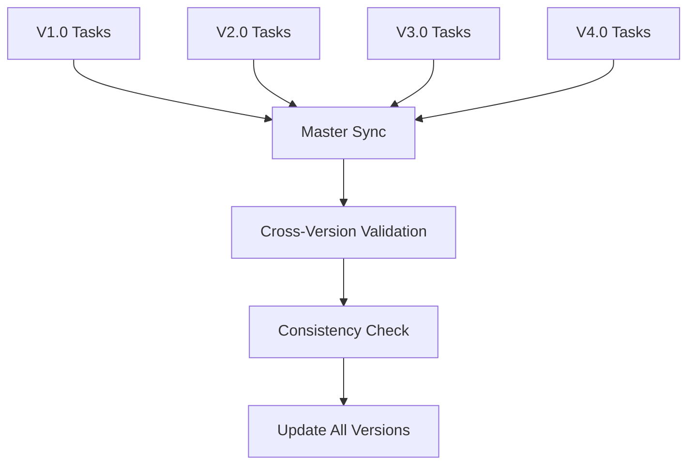
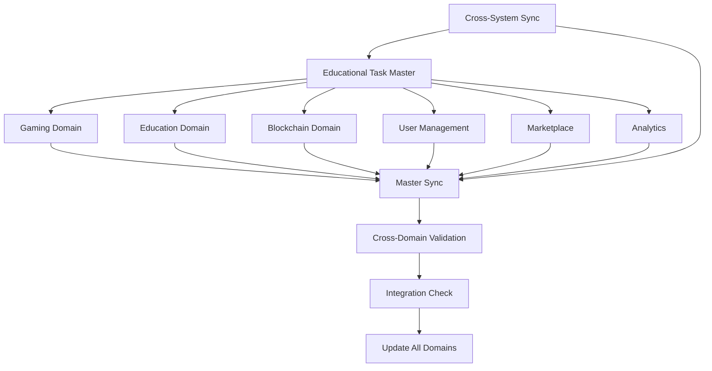

# 🎮 Game Task Master - Engineering Forge

**Versão**: 1.0  
**Data**: Janeiro 2025  
**Status**: 🚀 **ATIVO**  
**Tipo**: Master Task Synchronization System

---

## 🎯 **Visão Geral**

O **Game Task Master** é o sistema central de gerenciamento de tarefas para o
desenvolvimento do Engineering Forge. Este documento serve como o ponto de
sincronização principal entre todas as versões, domínios e fases de
desenvolvimento do jogo.

### **Objetivo**

- **Sincronizar** todas as tarefas entre versões
- **Padronizar** metodologia de desenvolvimento de jogos
- **Garantir** qualidade profissional em todas as fases
- **Facilitar** coordenação entre equipes
- **Manter** consistência arquitetural

### **Filosofia de Desenvolvimento**

- **Game-First Approach**: Toda tarefa deve considerar a experiência do jogador
- **Iterative Development**: Desenvolvimento em ciclos curtos com feedback
- **Quality Gates**: Checkpoints de qualidade em cada fase
- **Cross-Version Compatibility**: Compatibilidade entre versões
- **Professional Standards**: Padrões da indústria de jogos

---

## 🏗️ **Arquitetura do Sistema de Tarefas**

### **Hierarquia de Tarefas**

```
EPIC (Épico)
├── FEATURE (Feature)
│   ├── TASK (Tarefa Principal)
│   │   ├── SUBTASK (Subtarefa)
│   │   │   ├── MICROTASK (Microtarefa)
│   │   │   └── VALIDATION (Validação)
│   │   └── TESTING (Testes)
│   └── INTEGRATION (Integração)
└── RELEASE (Release)
```

### **Tipos de Tarefas por Categoria**

#### **🎮 Game Development Tasks**

- **GAMEPLAY**: Mecânicas de jogo
- **UI/UX**: Interface e experiência do usuário
- **AUDIO**: Sistema de áudio
- **GRAPHICS**: Gráficos e visual
- **PHYSICS**: Sistema de física
- **AI**: Inteligência artificial
- **NETWORKING**: Sistema de rede
- **PLATFORM**: Integração de plataforma

#### **🔧 Technical Tasks**

- **ARCHITECTURE**: Arquitetura do sistema
- **PERFORMANCE**: Otimização de performance
- **SECURITY**: Segurança
- **SCALABILITY**: Escalabilidade
- **MAINTENANCE**: Manutenção
- **DEPLOYMENT**: Deploy e DevOps

#### **📚 Content Tasks**

- **DESIGN**: Design de conteúdo
- **ART**: Arte e assets
- **WRITING**: Narrativa e textos
- **LOCALIZATION**: Localização
- **BALANCING**: Balanceamento

#### **🧪 Quality Tasks**

- **TESTING**: Testes
- **QA**: Garantia de qualidade
- **DEBUGGING**: Debug
- **OPTIMIZATION**: Otimização
- **DOCUMENTATION**: Documentação

---

## 📋 **Sistema de Classificação de Tarefas**

### **Por Complexidade**

- **🔴 CRITICAL**: Crítico para funcionamento básico
- **🟡 IMPORTANT**: Importante para experiência completa
- **🟢 NICE-TO-HAVE**: Melhorias e features avançadas
- **🔵 FUTURE**: Para versões futuras

### **Por Fase de Desenvolvimento**

- **PRE-PRODUCTION**: Planejamento e prototipagem
- **PRODUCTION**: Desenvolvimento principal
- **ALPHA**: Primeira versão jogável
- **BETA**: Versão quase final
- **GOLD**: Versão final
- **POST-LAUNCH**: Pós-lançamento

### **Por Risco**

- **🔴 HIGH RISK**: Alto risco técnico ou de negócio
- **🟡 MEDIUM RISK**: Risco médio
- **🟢 LOW RISK**: Baixo risco
- **🔵 NO RISK**: Sem risco

---

## 🎯 **Metodologia de Desenvolvimento de Jogos**

### **Game Development Lifecycle**

```
CONCEPT → PRE-PRODUCTION → PRODUCTION → ALPHA → BETA → GOLD → POST-LAUNCH
```

### **Fases Detalhadas**

#### **1. CONCEPT (Conceito)**

- **Duração**: 2-4 semanas
- **Objetivo**: Definir conceito e visão
- **Entregáveis**: Game Design Document, Protótipo de papel
- **Critérios de Saída**: Conceito aprovado, protótipo validado

#### **2. PRE-PRODUCTION (Pré-produção)**

- **Duração**: 4-8 semanas
- **Objetivo**: Planejar e prototipar
- **Entregáveis**: Arquitetura técnica, Protótipos funcionais
- **Critérios de Saída**: Arquitetura aprovada, protótipos funcionando

#### **3. PRODUCTION (Produção)**

- **Duração**: 12-24 semanas
- **Objetivo**: Desenvolver o jogo
- **Entregáveis**: Features implementadas, Assets criados
- **Critérios de Saída**: Todas as features implementadas

#### **4. ALPHA (Alpha)**

- **Duração**: 4-6 semanas
- **Objetivo**: Primeira versão jogável
- **Entregáveis**: Jogo jogável, Feedback coletado
- **Critérios de Saída**: Jogo jogável do início ao fim

#### **5. BETA (Beta)**

- **Duração**: 6-8 semanas
- **Objetivo**: Versão quase final
- **Entregáveis**: Jogo polido, Bugs corrigidos
- **Critérios de Saída**: Jogo estável e polido

#### **6. GOLD (Gold)**

- **Duração**: 2-4 semanas
- **Objetivo**: Versão final
- **Entregáveis**: Jogo final, Deploy em produção
- **Critérios de Saída**: Jogo lançado com sucesso

#### **7. POST-LAUNCH (Pós-lançamento)**

- **Duração**: Contínuo
- **Objetivo**: Manutenção e melhorias
- **Entregáveis**: Updates, Correções, Novas features
- **Critérios de Saída**: Jogo mantido e evoluindo

---

## 🎮 **Task Templates por Categoria**

### **Template: Gameplay Task**

```markdown
# [TASK-GAMEPLAY-XXX] [Nome da Mecânica]

## 📋 Informações da Tarefa

- **ID**: TASK-GAMEPLAY-XXX
- **Categoria**: Gameplay
- **Versão**: [V1.0 | V2.0 | V3.0 | V4.0]
- **Fase**: [PRE-PRODUCTION | PRODUCTION | ALPHA | BETA | GOLD]
- **Prioridade**: [CRITICAL | IMPORTANT | NICE-TO-HAVE | FUTURE]
- **Risco**: [HIGH | MEDIUM | LOW | NO]
- **Estimativa**: [X horas]
- **Responsável**: [Nome/Role]

## 🎯 Objetivo

[Descrição clara do que a mecânica deve fazer]

## 🎮 Especificações de Gameplay

- **Mecânica Principal**: [Descrição da mecânica]
- **Inputs do Jogador**: [Como o jogador interage]
- **Feedback Visual**: [O que o jogador vê]
- **Feedback Audio**: [O que o jogador ouve]
- **Feedback Haptic**: [O que o jogador sente]
- **Balanceamento**: [Como a mecânica é balanceada]

## 🛠️ Especificações Técnicas

- **Arquivos Afetados**: [Lista de arquivos]
- **Dependências**: [Outras tarefas necessárias]
- **APIs Necessárias**: [APIs que serão usadas]
- **Performance**: [Requisitos de performance]

## 🧪 Critérios de Aceitação

- [ ] Mecânica funciona conforme especificado
- [ ] Performance atende aos requisitos
- [ ] Feedback é claro e responsivo
- [ ] Balanceamento está correto
- [ ] Testes passam
- [ ] Documentação atualizada

## 🎯 Subtarefas

1. **Design da Mecânica** (X horas)
   - [ ] Definir comportamento
   - [ ] Criar mockups
   - [ ] Validar com stakeholders
2. **Implementação** (X horas)
   - [ ] Criar código base
   - [ ] Implementar lógica
   - [ ] Integrar com sistema
3. **Polimento** (X horas)
   - [ ] Ajustar balanceamento
   - [ ] Melhorar feedback
   - [ ] Otimizar performance
4. **Testes** (X horas)
   - [ ] Testes unitários
   - [ ] Testes de integração
   - [ ] Testes de gameplay
5. **Validação** (X horas)
   - [ ] Teste com usuários
   - [ ] Feedback de stakeholders
   - [ ] Ajustes finais

## 📊 Métricas de Sucesso

- **Performance**: [Métricas de performance]
- **Usabilidade**: [Métricas de usabilidade]
- **Engajamento**: [Métricas de engajamento]
- **Qualidade**: [Métricas de qualidade]

## 🔄 Dependências

- **Bloqueia**: [Tarefas que dependem desta]
- **Depende de**: [Tarefas necessárias]
- **Integra com**: [Outras mecânicas]

## 📝 Notas

[Notas adicionais, considerações especiais, etc.]
```

### **Template: Technical Task**

```markdown
# [TASK-TECH-XXX] [Nome da Feature Técnica]

## 📋 Informações da Tarefa

- **ID**: TASK-TECH-XXX
- **Categoria**: Technical
- **Versão**: [V1.0 | V2.0 | V3.0 | V4.0]
- **Fase**: [PRE-PRODUCTION | PRODUCTION | ALPHA | BETA | GOLD]
- **Prioridade**: [CRITICAL | IMPORTANT | NICE-TO-HAVE | FUTURE]
- **Risco**: [HIGH | MEDIUM | LOW | NO]
- **Estimativa**: [X horas]
- **Responsável**: [Nome/Role]

## 🎯 Objetivo

[Descrição clara do que a feature técnica deve fazer]

## 🛠️ Especificações Técnicas

- **Arquitetura**: [Como se integra na arquitetura]
- **APIs**: [APIs que serão criadas/usadas]
- **Performance**: [Requisitos de performance]
- **Escalabilidade**: [Requisitos de escalabilidade]
- **Segurança**: [Considerações de segurança]

## 🧪 Critérios de Aceitação

- [ ] Feature funciona conforme especificado
- [ ] Performance atende aos requisitos
- [ ] Código segue padrões estabelecidos
- [ ] Testes passam
- [ ] Documentação atualizada
- [ ] Code review aprovado

## 🎯 Subtarefas

1. **Análise e Design** (X horas)
   - [ ] Analisar requisitos
   - [ ] Projetar arquitetura
   - [ ] Validar com equipe
2. **Implementação** (X horas)
   - [ ] Criar código base
   - [ ] Implementar funcionalidade
   - [ ] Integrar com sistema
3. **Testes** (X horas)
   - [ ] Testes unitários
   - [ ] Testes de integração
   - [ ] Testes de performance
4. **Documentação** (X horas)
   - [ ] Documentar código
   - [ ] Atualizar documentação técnica
   - [ ] Criar guias de uso

## 📊 Métricas de Sucesso

- **Performance**: [Métricas de performance]
- **Qualidade**: [Métricas de qualidade]
- **Manutenibilidade**: [Métricas de manutenibilidade]
- **Cobertura de Testes**: [% de cobertura]

## 🔄 Dependências

- **Bloqueia**: [Tarefas que dependem desta]
- **Depende de**: [Tarefas necessárias]
- **Integra com**: [Outras features técnicas]
```

---

## 🎯 **Sistema de Sincronização**

### **Sincronização Entre Versões**



### **Sincronização Entre Domínios**



### **Comandos de Sincronização**

```bash
# Sincronizar todas as versões
@ai sync-all-versions

# Sincronizar todos os domínios
@ai sync-all-domains

# Sincronizar versão específica
@ai sync-version V1.0

# Sincronizar domínio específico
@ai sync-domain gaming

# Sincronizar com sistema educacional
@ai sync-educational-gaming V1.0

# Verificar consistência
@ai check-consistency all

# Validar dependências
@ai validate-dependencies

# Validar dependências educacionais
@ai validate-educational-dependencies

# Atualizar métricas
@ai update-metrics all

# Atualizar métricas educacionais
@ai update-educational-metrics
```

---

## 📊 **Métricas e KPIs**

### **Métricas de Desenvolvimento**

- **Velocity**: Story points por sprint
- **Burndown**: Progresso do sprint
- **Quality**: Bugs por feature
- **Performance**: Tempo de implementação
- **Coverage**: Cobertura de testes

### **Métricas de Gameplay**

- **Engagement**: Tempo de sessão
- **Retention**: Retenção de usuários
- **Completion**: Taxa de conclusão
- **Satisfaction**: Satisfação do usuário
- **Performance**: Performance do jogo

### **Métricas de Qualidade**

- **Bug Density**: Bugs por linha de código
- **Test Coverage**: % de cobertura
- **Code Quality**: Métricas de qualidade
- **Performance**: Métricas de performance
- **Security**: Vulnerabilidades

---

## 🚀 **Workflow de Desenvolvimento**

### **1. Planejamento**

```bash
@ai create-epic [nome] [descrição]
@ai create-feature [epic-id] [nome] [descrição]
@ai create-task [feature-id] [nome] [descrição]
@ai estimate-task [task-id] [horas]
@ai assign-task [task-id] [responsável]
```

### **2. Desenvolvimento**

```bash
@ai start-task [task-id]
@ai update-progress [task-id] [percentual]
@ai add-subtask [task-id] [nome] [descrição]
@ai complete-subtask [subtask-id]
@ai request-review [task-id]
```

### **3. Testes**

```bash
@ai create-tests [task-id]
@ai run-tests [task-id]
@ai fix-bugs [task-id] [bug-list]
@ai validate-task [task-id]
```

### **4. Finalização**

```bash
@ai complete-task [task-id] [notas]
@ai update-documentation [task-id]
@ai sync-all
@ai update-metrics
```

---

## 🎯 **Quality Gates**

### **Gate 1: Design Approval**

- [ ] Design aprovado por stakeholders
- [ ] Protótipo funcional
- [ ] Especificações completas
- [ ] Estimativas validadas

### **Gate 2: Implementation Complete**

- [ ] Código implementado
- [ ] Testes unitários passando
- [ ] Code review aprovado
- [ ] Documentação atualizada

### **Gate 3: Integration Ready**

- [ ] Integração com sistema
- [ ] Testes de integração passando
- [ ] Performance validada
- [ ] Segurança verificada

### **Gate 4: Release Ready**

- [ ] Testes E2E passando
- [ ] QA aprovado
- [ ] Performance otimizada
- [ ] Documentação completa

---

## 🔄 **Atualizações e Manutenção**

### **Frequência de Atualizações**

- **Diária**: Progresso de tarefas
- **Semanal**: Métricas e KPIs
- **Mensal**: Revisão de roadmap
- **Trimestral**: Revisão de arquitetura

### **Responsabilidades**

- **Task Master**: Manter sincronização
- **Domain Leads**: Atualizar domínios
- **Version Leads**: Atualizar versões
- **Team Leads**: Atualizar progresso

---

## 📞 **Contatos e Suporte**

### **Responsáveis**

- **Task Master**: [Nome]
- **Game Design Lead**: [Nome]
- **Technical Lead**: [Nome]
- **QA Lead**: [Nome]

### **Canais de Comunicação**

- **Slack**: #engineering-forge-tasks
- **Discord**: #task-management
- **Email**: tasks@engineeringforge.com
- **Jira**: [Link para projeto]

---

## 🔄 **Histórico de Atualizações**

| Data       | Versão | Mudanças                 | Responsável  |
| ---------- | ------ | ------------------------ | ------------ |
| 30/01/2025 | 1.0.0  | Criação do sistema       | AI Assistant |
| 30/01/2025 | 1.0.1  | Adição de templates      | AI Assistant |
| 30/01/2025 | 1.0.2  | Sistema de sincronização | AI Assistant |

---

_Este documento é atualizado regularmente. Última atualização: Janeiro 2025_

**Status**: 🟢 **ATIVO** | **Versão**: 1.0 | **Próxima Revisão**: Fevereiro 2025
