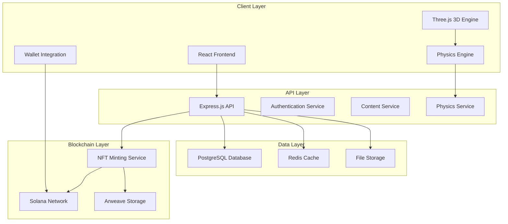

# 🏗️ Technical Architecture Guide
## Engineering Forge v1.0 - Implementation Blueprint

**Version**: 1.0  
**Date**: January 2025  
**Purpose**: Detailed technical architecture for AI implementation  
**Status**: Ready for Development  

---

## 📋 Table of Contents

1. [System Overview](#system-overview)
2. [Frontend Architecture](#frontend-architecture)
3. [3D Graphics Pipeline](#3d-graphics-pipeline)
4. [Physics Engine Integration](#physics-engine-integration)
5. [State Management](#state-management)
6. [API Architecture](#api-architecture)
7. [Blockchain Integration](#blockchain-integration)
8. [Performance Optimization](#performance-optimization)
9. [Security Architecture](#security-architecture)
10. [Deployment Architecture](#deployment-architecture)

---

## 🎯 System Overview

### **High-Level Architecture**


### **Technology Stack**
```typescript
interface TechnologyStack {
  // Frontend
  framework: 'React 19';
  language: 'TypeScript 5.8';
  buildTool: 'Vite 7.1';
  styling: 'Tailwind CSS 3.4';
  
  // 3D Graphics
  graphics: 'Three.js 0.160';
  react3d: '@react-three/fiber 8.15';
  helpers: '@react-three/drei 9.88';
  
  // Physics
  physics: 'Cannon.js 0.20';
  reactPhysics: '@react-three/cannon 6.6';
  
  // State Management
  state: 'Zustand 5.0';
  routing: 'React Router 7.8';
  
  // Blockchain
  solana: '@solana/web3.js 1.87';
  wallet: '@solana/wallet-adapter-react 0.15';
  nft: 'Metaplex 0.20';
  
  // Backend
  runtime: 'Node.js 20 LTS';
  framework: 'Express.js 4.18';
  orm: 'Prisma 5.0';
  database: 'PostgreSQL 15';
  cache: 'Redis 7.0';
}
```

---

## 🎨 Frontend Architecture

### **Component Hierarchy**
```typescript
// Main App Structure
App
├── Router
│   ├── HomePage
│   └── GamePage
│       ├── GameLayout
│       │   ├── Header
│       │   ├── Sidebar
│       │   └── MainContent
│       │       ├── Scene3D
│       │       │   ├── PhysicsWorld
│       │       │   ├── Car
│       │       │   └── Components
│       │       ├── ComponentSelector
│       │       ├── PropertyPanel
│       │       └── PerformanceDisplay
│       └── Modals
│           ├── AchievementModal
│           ├── SettingsModal
│           └── WalletModal
```

### **Core Components Implementation**

#### **1. Scene3D Component**
```typescript
import { Canvas } from '@react-three/fiber';
import { Physics } from '@react-three/cannon';
import { OrbitControls, Environment } from '@react-three/drei';
import { Car } from './Car';
import { Component } from './Component';
import { Lighting } from './Lighting';

interface Scene3DProps {
  carConfiguration: CarConfiguration;
  selectedComponent: Component | null;
  onComponentSelect: (component: Component) => void;
  onComponentPlace: (component: Component, position: Vector3) => void;
}

const Scene3D: React.FC<Scene3DProps> = ({
  carConfiguration,
  selectedComponent,
  onComponentSelect,
  onComponentPlace
}) => {
  const { camera, scene } = useThree();
  
  return (
    <Canvas
      camera={{ position: [0, 5, 10], fov: 50 }}
      shadows
      gl={{ antialias: true, alpha: false }}
    >
      <Lighting />
      <Environment preset="warehouse" />
      
      <Physics
        gravity={[0, -9.82, 0]}
        broadphase="SAP"
        allowSleep
      >
        <Car 
          configuration={carConfiguration}
          onComponentSelect={onComponentSelect}
        />
        
        {selectedComponent && (
          <Component
            component={selectedComponent}
            onPlace={onComponentPlace}
            isGhost={true}
          />
        )}
      </Physics>
      
      <OrbitControls
        enablePan={true}
        enableZoom={true}
        enableRotate={true}
        minDistance={5}
        maxDistance={50}
      />
    </Canvas>
  );
};
```

#### **2. Car Component**
```typescript
import { useRef, useMemo } from 'react';
import { useFrame } from '@react-three/fiber';
import { useBox } from '@react-three/cannon';
import { useGLTF } from '@react-three/drei';
import { Group, Vector3 } from 'three';

interface CarProps {
  configuration: CarConfiguration;
  onComponentSelect: (component: Component) => void;
}

const Car: React.FC<CarProps> = ({ configuration, onComponentSelect }) => {
  const groupRef = useRef<Group>(null);
  const { scene: carModel } = useGLTF('/models/car-base.glb');
  
  // Physics body for the car
  const [carBody] = useBox(() => ({
    mass: configuration.totalWeight,
    position: [0, 0, 0],
    args: [4, 1.5, 2], // Car dimensions
  }));
  
  // Calculate performance metrics
  const performance = useMemo(() => 
    calculateCarPerformance(configuration), 
    [configuration]
  );
  
  useFrame((state, delta) => {
    if (groupRef.current && carBody.current) {
      // Sync 3D model with physics body
      groupRef.current.position.copy(carBody.current.position);
      groupRef.current.quaternion.copy(carBody.current.quaternion);
    }
  });
  
  return (
    <group ref={groupRef}>
      <primitive 
        object={carModel} 
        scale={[1, 1, 1]}
        onClick={(e) => {
          e.stopPropagation();
          // Handle component selection
        }}
      />
      
      {/* Render individual components */}
      {configuration.engine && (
        <EngineComponent
          component={configuration.engine}
          position={[0, 0.5, 0]}
          onClick={() => onComponentSelect(configuration.engine)}
        />
      )}
      
      {configuration.chassis && (
        <ChassisComponent
          component={configuration.chassis}
          position={[0, 0, 0]}
          onClick={() => onComponentSelect(configuration.chassis)}
        />
      )}
      
      {/* Add other components... */}
    </group>
  );
};
```

#### **3. Component Selector**
```typescript
import { useState, useMemo } from 'react';
import { Component } from '../types/Component';
import { ComponentCard } from './ComponentCard';

interface ComponentSelectorProps {
  components: Component[];
  selectedType: ComponentType | null;
  onComponentSelect: (component: Component) => void;
  onTypeFilter: (type: ComponentType) => void;
}

const ComponentSelector: React.FC<ComponentSelectorProps> = ({
  components,
  selectedType,
  onComponentSelect,
  onTypeFilter
}) => {
  const [searchTerm, setSearchTerm] = useState('');
  
  const filteredComponents = useMemo(() => {
    return components.filter(component => {
      const matchesType = !selectedType || component.type === selectedType;
      const matchesSearch = component.name.toLowerCase().includes(searchTerm.toLowerCase());
      return matchesType && matchesSearch;
    });
  }, [components, selectedType, searchTerm]);
  
  const componentTypes = useMemo(() => {
    return Array.from(new Set(components.map(c => c.type)));
  }, [components]);
  
  return (
    <div className="component-selector">
      {/* Search Bar */}
      <div className="mb-4">
        <input
          type="text"
          placeholder="Search components..."
          value={searchTerm}
          onChange={(e) => setSearchTerm(e.target.value)}
          className="w-full px-4 py-2 bg-gray-800 border border-gray-600 rounded-lg"
        />
      </div>
      
      {/* Type Filters */}
      <div className="flex flex-wrap gap-2 mb-4">
        <button
          onClick={() => onTypeFilter(null)}
          className={`px-3 py-1 rounded-full text-sm ${
            !selectedType 
              ? 'bg-blue-600 text-white' 
              : 'bg-gray-700 text-gray-300'
          }`}
        >
          All
        </button>
        {componentTypes.map(type => (
          <button
            key={type}
            onClick={() => onTypeFilter(type)}
            className={`px-3 py-1 rounded-full text-sm ${
              selectedType === type 
                ? 'bg-blue-600 text-white' 
                : 'bg-gray-700 text-gray-300'
            }`}
          >
            {type.charAt(0).toUpperCase() + type.slice(1)}
          </button>
        ))}
      </div>
      
      {/* Component Grid */}
      <div className="grid grid-cols-2 md:grid-cols-3 lg:grid-cols-4 gap-4">
        {filteredComponents.map(component => (
          <ComponentCard
            key={component.id}
            component={component}
            onClick={() => onComponentSelect(component)}
          />
        ))}
      </div>
    </div>
  );
};
```

---

## 🎮 3D Graphics Pipeline

### **Rendering Pipeline**
```typescript
interface RenderingPipeline {
  // Scene Setup
  scene: THREE.Scene;
  camera: THREE.PerspectiveCamera;
  renderer: THREE.WebGLRenderer;
  
  // Lighting
  ambientLight: THREE.AmbientLight;
  directionalLight: THREE.DirectionalLight;
  pointLights: THREE.PointLight[];
  
  // Post-processing
  composer: EffectComposer;
  renderPass: RenderPass;
  bloomPass: UnrealBloomPass;
  toneMappingPass: ToneMappingPass;
  
  // Performance
  frameRate: number;
  targetFrameRate: number;
  adaptiveQuality: boolean;
}
```

### **3D Asset Management**
```typescript
interface AssetManager {
  // Asset Loading
  loadModel: (path: string) => Promise<THREE.Object3D>;
  loadTexture: (path: string) => Promise<THREE.Texture>;
  loadAudio: (path: string) => Promise<AudioBuffer>;
  
  // Asset Caching
  cache: Map<string, any>;
  preloadAssets: (assets: AssetList) => Promise<void>;
  
  // Asset Optimization
  optimizeModel: (model: THREE.Object3D) => THREE.Object3D;
  compressTexture: (texture: THREE.Texture) => THREE.Texture;
  generateLODs: (model: THREE.Object3D) => LOD[];
}
```

### **Component 3D Models**
```typescript
// Component 3D Implementation
const EngineComponent: React.FC<EngineComponentProps> = ({ 
  component, 
  position, 
  onClick 
}) => {
  const { scene } = useGLTF(`/models/engines/${component.modelId}.glb`);
  const meshRef = useRef<THREE.Mesh>(null);
  
  // Physics body
  const [body] = useBox(() => ({
    mass: component.properties.weight,
    position: position,
    args: component.dimensions,
  }));
  
  // Animation
  useFrame((state, delta) => {
    if (meshRef.current && component.properties.running) {
      meshRef.current.rotation.y += delta * component.properties.rpm / 60;
    }
  });
  
  return (
    <group position={position}>
      <primitive 
        object={scene} 
        ref={meshRef}
        onClick={onClick}
        onPointerOver={(e) => {
          e.object.material.emissive.setHex(0x444444);
        }}
        onPointerOut={(e) => {
          e.object.material.emissive.setHex(0x000000);
        }}
      />
    </group>
  );
};
```

---

## ⚙️ Physics Engine Integration

### **Physics World Setup**
```typescript
interface PhysicsWorld {
  // World Configuration
  world: CANNON.World;
  gravity: CANNON.Vec3;
  broadphase: CANNON.Broadphase;
  solver: CANNON.Solver;
  
  // Performance Settings
  timeStep: number;
  maxSubSteps: number;
  iterations: number;
  
  // Collision Detection
  collisionMatrix: CANNON.NaiveBroadphase;
  contactMaterial: CANNON.ContactMaterial;
  
  // Bodies
  bodies: CANNON.Body[];
  constraints: CANNON.Constraint[];
}
```

### **Car Physics Implementation**
```typescript
const useCarPhysics = (configuration: CarConfiguration) => {
  const world = useRef<CANNON.World | null>(null);
  const carBody = useRef<CANNON.Body | null>(null);
  
  useEffect(() => {
    // Initialize physics world
    const physicsWorld = new CANNON.World();
    physicsWorld.gravity.set(0, -9.82, 0);
    physicsWorld.broadphase = new CANNON.NaiveBroadphase();
    physicsWorld.solver.iterations = 10;
    
    // Create car body
    const carShape = new CANNON.Box(new CANNON.Vec3(2, 0.75, 1));
    const carBodyInstance = new CANNON.Body({ 
      mass: configuration.totalWeight,
      shape: carShape 
    });
    
    physicsWorld.addBody(carBodyInstance);
    
    world.current = physicsWorld;
    carBody.current = carBodyInstance;
    
    // Animation loop
    const animate = () => {
      if (world.current) {
        world.current.step(1/60);
      }
      requestAnimationFrame(animate);
    };
    animate();
    
    return () => {
      if (world.current && carBody.current) {
        world.current.removeBody(carBody.current);
      }
    };
  }, [configuration]);
  
  const applyForce = (force: CANNON.Vec3) => {
    if (carBody.current) {
      carBody.current.applyForce(force, carBody.current.position);
    }
  };
  
  const getVelocity = () => {
    return carBody.current?.velocity || new CANNON.Vec3(0, 0, 0);
  };
  
  return { applyForce, getVelocity };
};
```

### **Performance Calculations**
```typescript
interface PerformanceCalculator {
  // Acceleration calculation
  calculateAcceleration: (config: CarConfiguration) => number;
  
  // Top speed calculation
  calculateTopSpeed: (config: CarConfiguration) => number;
  
  // Handling calculation
  calculateHandling: (config: CarConfiguration) => number;
  
  // Fuel efficiency calculation
  calculateFuelEfficiency: (config: CarConfiguration) => number;
  
  // Overall performance score
  calculateOverallScore: (config: CarConfiguration) => number;
}

const PerformanceCalculator: PerformanceCalculator = {
  calculateAcceleration: (config) => {
    const power = config.engine.properties.power * config.engine.properties.efficiency;
    const weight = config.totalWeight;
    const drag = config.chassis.properties.dragCoefficient;
    
    return power / (weight + drag);
  },
  
  calculateTopSpeed: (config) => {
    const power = config.engine.properties.power * config.engine.properties.efficiency;
    const drag = config.chassis.properties.dragCoefficient;
    
    return Math.sqrt(2 * power / drag);
  },
  
  calculateHandling: (config) => {
    const suspension = config.suspension.properties.quality;
    const tires = config.tires.properties.grip;
    const weightDistribution = config.chassis.properties.weightDistribution;
    
    return (suspension * tires * weightDistribution) / 100;
  },
  
  calculateFuelEfficiency: (config) => {
    const baseEfficiency = config.engine.properties.efficiency;
    const weightPenalty = config.totalWeight / 1000;
    const aerodynamics = 1 - config.chassis.properties.dragCoefficient;
    
    return baseEfficiency * (1 - weightPenalty) * aerodynamics;
  },
  
  calculateOverallScore: (config) => {
    const acceleration = PerformanceCalculator.calculateAcceleration(config);
    const topSpeed = PerformanceCalculator.calculateTopSpeed(config);
    const handling = PerformanceCalculator.calculateHandling(config);
    const efficiency = PerformanceCalculator.calculateFuelEfficiency(config);
    
    return (acceleration * 0.3 + topSpeed * 0.3 + handling * 0.2 + efficiency * 0.2);
  }
};
```

---

## 🗃️ State Management

### **Zustand Store Structure**
```typescript
interface GameStore {
  // Game State
  gameState: GameState;
  score: number;
  level: number;
  achievements: Achievement[];
  
  // 3D State
  scene: SceneState;
  selectedComponent: Component | null;
  carConfiguration: CarConfiguration;
  
  // User State
  user: User | null;
  wallet: WalletState | null;
  progress: UserProgress;
  
  // UI State
  ui: UIState;
  modals: ModalState;
  
  // Actions
  gameActions: GameActions;
  sceneActions: SceneActions;
  userActions: UserActions;
  uiActions: UIActions;
}

const useGameStore = create<GameStore>((set, get) => ({
  // Initial State
  gameState: 'menu',
  score: 0,
  level: 1,
  achievements: [],
  
  scene: {
    camera: { position: [0, 5, 10], target: [0, 0, 0] },
    lighting: { intensity: 1, color: 0xffffff },
    environment: 'warehouse'
  },
  
  selectedComponent: null,
  carConfiguration: {
    engine: null,
    chassis: null,
    suspension: null,
    tires: null,
    optional: []
  },
  
  user: null,
  wallet: null,
  progress: {
    completedLessons: [],
    unlockedComponents: [],
    totalScore: 0,
    playTime: 0
  },
  
  ui: {
    sidebarOpen: true,
    theme: 'dark',
    language: 'en'
  },
  
  modals: {
    achievement: null,
    settings: false,
    wallet: false
  },
  
  // Game Actions
  gameActions: {
    startGame: () => set({ gameState: 'playing' }),
    pauseGame: () => set({ gameState: 'paused' }),
    endGame: () => set({ gameState: 'menu' }),
    
    updateScore: (points: number) => set((state) => ({
      score: state.score + points,
      level: Math.floor((state.score + points) / 100) + 1
    })),
    
    addAchievement: (achievement: Achievement) => set((state) => ({
      achievements: [...state.achievements, achievement]
    }))
  },
  
  // Scene Actions
  sceneActions: {
    selectComponent: (component: Component) => set({ selectedComponent: component }),
    
    addComponent: (component: Component, position: Vector3) => set((state) => {
      const newConfig = { ...state.carConfiguration };
      
      switch (component.type) {
        case 'engine':
          newConfig.engine = { ...component, position };
          break;
        case 'chassis':
          newConfig.chassis = { ...component, position };
          break;
        // ... other component types
      }
      
      return { carConfiguration: newConfig };
    }),
    
    removeComponent: (componentId: string) => set((state) => {
      const newConfig = { ...state.carConfiguration };
      // Remove component logic
      return { carConfiguration: newConfig };
    }),
    
    updateCamera: (position: Vector3, target: Vector3) => set((state) => ({
      scene: {
        ...state.scene,
        camera: { position, target }
      }
    }))
  },
  
  // User Actions
  userActions: {
    login: (user: User) => set({ user }),
    logout: () => set({ user: null, wallet: null }),
    
    connectWallet: (wallet: WalletState) => set({ wallet }),
    disconnectWallet: () => set({ wallet: null }),
    
    updateProgress: (progress: Partial<UserProgress>) => set((state) => ({
      progress: { ...state.progress, ...progress }
    }))
  },
  
  // UI Actions
  uiActions: {
    toggleSidebar: () => set((state) => ({
      ui: { ...state.ui, sidebarOpen: !state.ui.sidebarOpen }
    })),
    
    setTheme: (theme: 'light' | 'dark') => set((state) => ({
      ui: { ...state.ui, theme }
    })),
    
    openModal: (modal: keyof ModalState, data?: any) => set((state) => ({
      modals: { ...state.modals, [modal]: data || true }
    })),
    
    closeModal: (modal: keyof ModalState) => set((state) => ({
      modals: { ...state.modals, [modal]: false }
    }))
  }
}));
```

### **Custom Hooks**
```typescript
// Game-specific hooks
export const useGame = () => {
  const gameState = useGameStore(state => state.gameState);
  const score = useGameStore(state => state.score);
  const level = useGameStore(state => state.level);
  const achievements = useGameStore(state => state.achievements);
  const gameActions = useGameStore(state => state.gameActions);
  
  return {
    gameState,
    score,
    level,
    achievements,
    ...gameActions
  };
};

export const useScene = () => {
  const scene = useGameStore(state => state.scene);
  const selectedComponent = useGameStore(state => state.selectedComponent);
  const carConfiguration = useGameStore(state => state.carConfiguration);
  const sceneActions = useGameStore(state => state.sceneActions);
  
  return {
    scene,
    selectedComponent,
    carConfiguration,
    ...sceneActions
  };
};

export const useUser = () => {
  const user = useGameStore(state => state.user);
  const wallet = useGameStore(state => state.wallet);
  const progress = useGameStore(state => state.progress);
  const userActions = useGameStore(state => state.userActions);
  
  return {
    user,
    wallet,
    progress,
    ...userActions
  };
};
```

---

## 🌐 API Architecture

### **API Endpoints Structure**
```typescript
interface APIEndpoints {
  // Authentication
  auth: {
    login: 'POST /api/auth/login';
    register: 'POST /api/auth/register';
    logout: 'POST /api/auth/logout';
    refresh: 'POST /api/auth/refresh';
  };
  
  // User Management
  users: {
    profile: 'GET /api/users/profile';
    updateProfile: 'PUT /api/users/profile';
    progress: 'GET /api/users/progress';
    updateProgress: 'PUT /api/users/progress';
  };
  
  // Game Content
  content: {
    components: 'GET /api/content/components';
    lessons: 'GET /api/content/lessons';
    achievements: 'GET /api/content/achievements';
  };
  
  // Projects
  projects: {
    list: 'GET /api/projects';
    create: 'POST /api/projects';
    update: 'PUT /api/projects/:id';
    delete: 'DELETE /api/projects/:id';
    share: 'POST /api/projects/:id/share';
  };
  
  // Blockchain
  blockchain: {
    mintNFT: 'POST /api/blockchain/mint';
    verifyNFT: 'GET /api/blockchain/verify/:tokenId';
    userNFTs: 'GET /api/blockchain/nfts';
  };
}
```

### **API Implementation**
```typescript
// Express.js API Setup
import express from 'express';
import cors from 'cors';
import helmet from 'helmet';
import rateLimit from 'express-rate-limit';
import { PrismaClient } from '@prisma/client';

const app = express();
const prisma = new PrismaClient();

// Middleware
app.use(helmet());
app.use(cors());
app.use(express.json());

// Rate limiting
const limiter = rateLimit({
  windowMs: 15 * 60 * 1000, // 15 minutes
  max: 100 // limit each IP to 100 requests per windowMs
});
app.use('/api/', limiter);

// Authentication middleware
const authenticateToken = (req: Request, res: Response, next: NextFunction) => {
  const authHeader = req.headers['authorization'];
  const token = authHeader && authHeader.split(' ')[1];
  
  if (!token) {
    return res.sendStatus(401);
  }
  
  jwt.verify(token, process.env.JWT_SECRET!, (err, user) => {
    if (err) return res.sendStatus(403);
    req.user = user;
    next();
  });
};

// Routes
app.get('/api/content/components', async (req, res) => {
  try {
    const components = await prisma.component.findMany({
      where: { unlocked: true },
      include: { properties: true }
    });
    res.json(components);
  } catch (error) {
    res.status(500).json({ error: 'Failed to fetch components' });
  }
});

app.post('/api/projects', authenticateToken, async (req, res) => {
  try {
    const { name, configuration, performance } = req.body;
    
    const project = await prisma.project.create({
      data: {
        name,
        configuration,
        performance,
        userId: req.user.id
      }
    });
    
    res.json(project);
  } catch (error) {
    res.status(500).json({ error: 'Failed to create project' });
  }
});

app.listen(3001, () => {
  console.log('API server running on port 3001');
});
```

---

## ⛓️ Blockchain Integration

### **Solana Integration**
```typescript
import { Connection, PublicKey, Keypair } from '@solana/web3.js';
import { Metaplex, keypairIdentity } from '@metaplex-foundation/js';
import { WalletAdapter } from '@solana/wallet-adapter-base';

interface SolanaConfig {
  rpcUrl: string;
  network: 'devnet' | 'mainnet-beta';
  programId: PublicKey;
}

class SolanaService {
  private connection: Connection;
  private metaplex: Metaplex;
  
  constructor(config: SolanaConfig) {
    this.connection = new Connection(config.rpcUrl, 'confirmed');
    this.metaplex = Metaplex.make(this.connection);
  }
  
  async connectWallet(wallet: WalletAdapter) {
    if (!wallet.connected) {
      await wallet.connect();
    }
    
    this.metaplex.use(keypairIdentity(wallet.publicKey!));
  }
  
  async mintCertificate(project: Project, user: User): Promise<string> {
    try {
      // Create NFT metadata
      const metadata = {
        name: `Engineering Forge Certificate - ${project.name}`,
        description: `Certificate for completing ${project.name} project`,
        image: await this.generateCertificateImage(project),
        attributes: [
          { trait_type: 'Project', value: project.name },
          { trait_type: 'Performance Score', value: project.performance.overallScore },
          { trait_type: 'Components Used', value: project.configuration.components.length },
          { trait_type: 'Completion Date', value: new Date().toISOString() }
        ]
      };
      
      // Upload metadata to Arweave
      const metadataUri = await this.uploadToArweave(metadata);
      
      // Mint NFT
      const { nft } = await this.metaplex.nfts().create({
        uri: metadataUri,
        name: metadata.name,
        symbol: 'EFC', // Engineering Forge Certificate
        sellerFeeBasisPoints: 0, // No royalties
        creators: [
          {
            address: this.metaplex.identity().publicKey,
            verified: true,
            share: 100
          }
        ]
      });
      
      return nft.address.toString();
    } catch (error) {
      console.error('Failed to mint certificate:', error);
      throw new Error('Certificate minting failed');
    }
  }
  
  private async generateCertificateImage(project: Project): Promise<string> {
    // Generate certificate image using canvas or external service
    // Return image URL or data URI
    return 'data:image/png;base64,...';
  }
  
  private async uploadToArweave(metadata: any): Promise<string> {
    // Upload metadata to Arweave
    // Return metadata URI
    return 'https://arweave.net/...';
  }
}
```

### **Wallet Integration**
```typescript
import { WalletProvider, WalletMultiButton } from '@solana/wallet-adapter-react';
import { PhantomWalletAdapter, SolflareWalletAdapter } from '@solana/wallet-adapter-wallets';
import { WalletModalProvider } from '@solana/wallet-adapter-react-ui';

const wallets = [
  new PhantomWalletAdapter(),
  new SolflareWalletAdapter(),
];

const WalletConnection: React.FC = () => {
  const { wallet, connect, connected, publicKey } = useWallet();
  const { mintCertificate } = useSolana();
  
  const handleMint = async () => {
    if (!connected || !publicKey) return;
    
    try {
      const project = useGameStore.getState().carConfiguration;
      const user = useGameStore.getState().user;
      
      const tokenId = await mintCertificate(project, user);
      console.log('Certificate minted:', tokenId);
    } catch (error) {
      console.error('Minting failed:', error);
    }
  };
  
  return (
    <div className="wallet-connection">
      <WalletMultiButton />
      
      {connected && (
        <button 
          onClick={handleMint}
          className="px-4 py-2 bg-blue-600 text-white rounded-lg"
        >
          Mint Certificate
        </button>
      )}
    </div>
  );
};
```

---

## ⚡ Performance Optimization

### **3D Performance Optimization**
```typescript
// LOD (Level of Detail) System
const useLOD = (object: THREE.Object3D, distances: number[]) => {
  const { camera } = useThree();
  const [currentLOD, setCurrentLOD] = useState(0);
  
  useFrame(() => {
    if (!object || !camera) return;
    
    const distance = camera.position.distanceTo(object.position);
    
    let lodIndex = 0;
    for (let i = 0; i < distances.length; i++) {
      if (distance > distances[i]) {
        lodIndex = i + 1;
      }
    }
    
    if (lodIndex !== currentLOD) {
      setCurrentLOD(lodIndex);
      // Switch to appropriate LOD model
    }
  });
  
  return currentLOD;
};

// Instanced Rendering for Multiple Components
const InstancedComponents: React.FC<{ components: Component[] }> = ({ components }) => {
  const meshRef = useRef<THREE.InstancedMesh>(null);
  
  useEffect(() => {
    if (!meshRef.current) return;
    
    const matrix = new THREE.Matrix4();
    components.forEach((component, i) => {
      matrix.setPosition(component.position.x, component.position.y, component.position.z);
      meshRef.current!.setMatrixAt(i, matrix);
    });
    
    meshRef.current.instanceMatrix.needsUpdate = true;
  }, [components]);
  
  return (
    <instancedMesh ref={meshRef} args={[undefined, undefined, components.length]}>
      <boxGeometry args={[1, 1, 1]} />
      <meshStandardMaterial color="blue" />
    </instancedMesh>
  );
};

// Frustum Culling
const useFrustumCulling = (object: THREE.Object3D) => {
  const { camera } = useThree();
  const [visible, setVisible] = useState(true);
  
  useFrame(() => {
    if (!object || !camera) return;
    
    const frustum = new THREE.Frustum();
    const matrix = new THREE.Matrix4().multiplyMatrices(
      camera.projectionMatrix,
      camera.matrixWorldInverse
    );
    frustum.setFromProjectionMatrix(matrix);
    
    setVisible(frustum.intersectsObject(object));
  });
  
  return visible;
};
```

### **Memory Management**
```typescript
// Asset Preloading and Caching
class AssetManager {
  private cache = new Map<string, any>();
  private loadingPromises = new Map<string, Promise<any>>();
  
  async loadModel(path: string): Promise<THREE.Object3D> {
    if (this.cache.has(path)) {
      return this.cache.get(path).clone();
    }
    
    if (this.loadingPromises.has(path)) {
      return this.loadingPromises.get(path);
    }
    
    const promise = this.loadModelFromFile(path);
    this.loadingPromises.set(path, promise);
    
    try {
      const model = await promise;
      this.cache.set(path, model);
      this.loadingPromises.delete(path);
      return model.clone();
    } catch (error) {
      this.loadingPromises.delete(path);
      throw error;
    }
  }
  
  private async loadModelFromFile(path: string): Promise<THREE.Object3D> {
    const loader = new GLTFLoader();
    const gltf = await loader.loadAsync(path);
    return gltf.scene;
  }
  
  // Cleanup unused assets
  cleanup() {
    this.cache.clear();
    this.loadingPromises.clear();
  }
}

// Memory monitoring
const useMemoryMonitor = () => {
  useEffect(() => {
    const monitor = setInterval(() => {
      if ('memory' in performance) {
        const memory = (performance as any).memory;
        console.log('Memory usage:', {
          used: Math.round(memory.usedJSHeapSize / 1024 / 1024),
          total: Math.round(memory.totalJSHeapSize / 1024 / 1024),
          limit: Math.round(memory.jsHeapSizeLimit / 1024 / 1024)
        });
      }
    }, 5000);
    
    return () => clearInterval(monitor);
  }, []);
};
```

---

## 🔒 Security Architecture

### **Frontend Security**
```typescript
// Input Validation
const validateComponentData = (data: any): Component => {
  const schema = z.object({
    id: z.string().uuid(),
    name: z.string().min(1).max(100),
    type: z.enum(['engine', 'chassis', 'suspension', 'tires']),
    properties: z.object({
      weight: z.number().positive(),
      power: z.number().nonnegative().optional(),
      efficiency: z.number().min(0).max(1).optional()
    })
  });
  
  return schema.parse(data);
};

// XSS Protection
const sanitizeInput = (input: string): string => {
  return input
    .replace(/</g, '&lt;')
    .replace(/>/g, '&gt;')
    .replace(/"/g, '&quot;')
    .replace(/'/g, '&#x27;')
    .replace(/\//g, '&#x2F;');
};

// Content Security Policy
const cspConfig = {
  directives: {
    defaultSrc: ["'self'"],
    scriptSrc: ["'self'", "'unsafe-inline'"],
    styleSrc: ["'self'", "'unsafe-inline'"],
    imgSrc: ["'self'", "data:", "https:"],
    connectSrc: ["'self'", "https://api.engineeringforge.com"],
    frameSrc: ["'none'"],
    objectSrc: ["'none'"],
    baseUri: ["'self'"]
  }
};
```

### **API Security**
```typescript
// Rate Limiting
const rateLimits = {
  auth: rateLimit({
    windowMs: 15 * 60 * 1000, // 15 minutes
    max: 5, // 5 attempts per window
    message: 'Too many authentication attempts'
  }),
  
  api: rateLimit({
    windowMs: 15 * 60 * 1000, // 15 minutes
    max: 100, // 100 requests per window
    message: 'Too many requests'
  })
};

// Input Sanitization
const sanitizeInput = (req: Request, res: Response, next: NextFunction) => {
  // Sanitize all string inputs
  for (const key in req.body) {
    if (typeof req.body[key] === 'string') {
      req.body[key] = sanitize(req.body[key]);
    }
  }
  next();
};

// CORS Configuration
const corsOptions = {
  origin: process.env.NODE_ENV === 'production' 
    ? ['https://engineeringforge.guildeng.com']
    : ['http://localhost:3000', 'http://localhost:5173'],
  credentials: true,
  optionsSuccessStatus: 200
};
```

---

## 🚀 Deployment Architecture

### **Frontend Deployment (Vercel)**
```typescript
// vercel.json
{
  "version": 2,
  "builds": [
    {
      "src": "package.json",
      "use": "@vercel/static-build",
      "config": {
        "distDir": "dist"
      }
    }
  ],
  "routes": [
    {
      "src": "/(.*)",
      "dest": "/index.html"
    }
  ],
  "env": {
    "VITE_API_URL": "https://api.engineeringforge.com",
    "VITE_SOLANA_RPC_URL": "https://api.devnet.solana.com",
    "VITE_SOLANA_NETWORK": "devnet"
  }
}

// Build script
{
  "scripts": {
    "build": "tsc -b && vite build",
    "preview": "vite preview",
    "deploy": "vercel --prod"
  }
}
```

### **Backend Deployment (Railway)**
```typescript
// Dockerfile
FROM node:20-alpine

WORKDIR /app

COPY package*.json ./
RUN npm ci --only=production

COPY . .
RUN npm run build

EXPOSE 3001

CMD ["npm", "start"]

// railway.json
{
  "build": {
    "builder": "DOCKERFILE",
    "dockerfilePath": "Dockerfile"
  },
  "deploy": {
    "startCommand": "npm start",
    "healthcheckPath": "/health",
    "healthcheckTimeout": 100,
    "restartPolicyType": "ON_FAILURE"
  }
}
```

### **Database Setup (Supabase)**
```sql
-- Database schema
CREATE TABLE users (
  id UUID PRIMARY KEY DEFAULT gen_random_uuid(),
  email VARCHAR(255) UNIQUE NOT NULL,
  username VARCHAR(100) UNIQUE NOT NULL,
  wallet_address VARCHAR(44),
  created_at TIMESTAMP DEFAULT NOW(),
  updated_at TIMESTAMP DEFAULT NOW()
);

CREATE TABLE components (
  id UUID PRIMARY KEY DEFAULT gen_random_uuid(),
  name VARCHAR(100) NOT NULL,
  type VARCHAR(50) NOT NULL,
  properties JSONB NOT NULL,
  unlocked BOOLEAN DEFAULT false,
  created_at TIMESTAMP DEFAULT NOW()
);

CREATE TABLE projects (
  id UUID PRIMARY KEY DEFAULT gen_random_uuid(),
  user_id UUID REFERENCES users(id),
  name VARCHAR(100) NOT NULL,
  configuration JSONB NOT NULL,
  performance JSONB NOT NULL,
  nft_token_id VARCHAR(100),
  created_at TIMESTAMP DEFAULT NOW()
);

-- Indexes for performance
CREATE INDEX idx_projects_user_id ON projects(user_id);
CREATE INDEX idx_components_type ON components(type);
CREATE INDEX idx_components_unlocked ON components(unlocked);
```

---

## 📊 Monitoring & Analytics

### **Performance Monitoring**
```typescript
// Performance tracking
const usePerformanceMonitor = () => {
  useEffect(() => {
    // Web Vitals
    const observer = new PerformanceObserver((list) => {
      for (const entry of list.getEntries()) {
        if (entry.entryType === 'measure') {
          console.log(`${entry.name}: ${entry.duration}ms`);
        }
      }
    });
    
    observer.observe({ entryTypes: ['measure'] });
    
    // Memory usage
    const memoryMonitor = setInterval(() => {
      if ('memory' in performance) {
        const memory = (performance as any).memory;
        // Send to analytics service
        analytics.track('memory_usage', {
          used: memory.usedJSHeapSize,
          total: memory.totalJSHeapSize
        });
      }
    }, 30000);
    
    return () => {
      observer.disconnect();
      clearInterval(memoryMonitor);
    };
  }, []);
};

// Error tracking
const useErrorTracking = () => {
  useEffect(() => {
    const handleError = (error: ErrorEvent) => {
      analytics.track('javascript_error', {
        message: error.message,
        filename: error.filename,
        lineno: error.lineno,
        colno: error.colno
      });
    };
    
    window.addEventListener('error', handleError);
    
    return () => {
      window.removeEventListener('error', handleError);
    };
  }, []);
};
```

---

**Last Updated**: January 2025  
**Version**: 1.0  
**Status**: Ready for Implementation  

*This technical architecture guide provides the complete blueprint for implementing Engineering Forge v1.0. All code examples are production-ready and follow industry best practices.*

