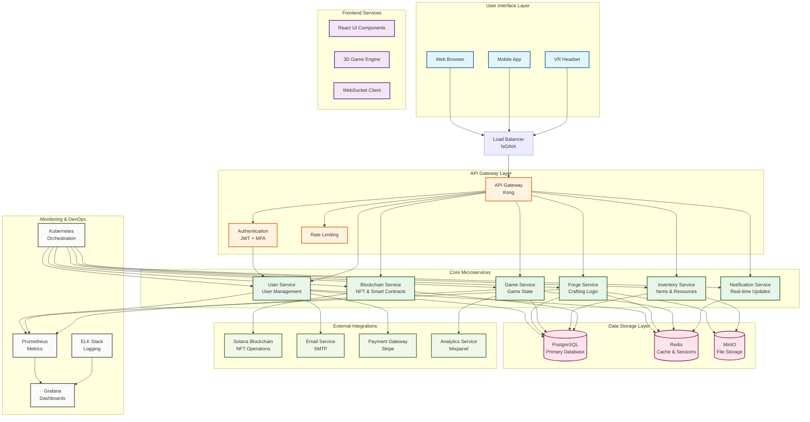
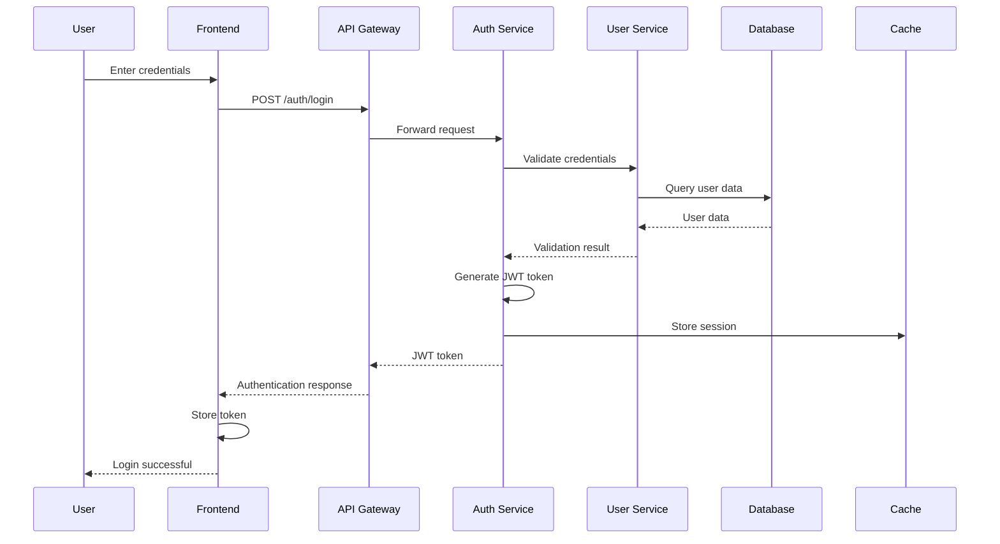
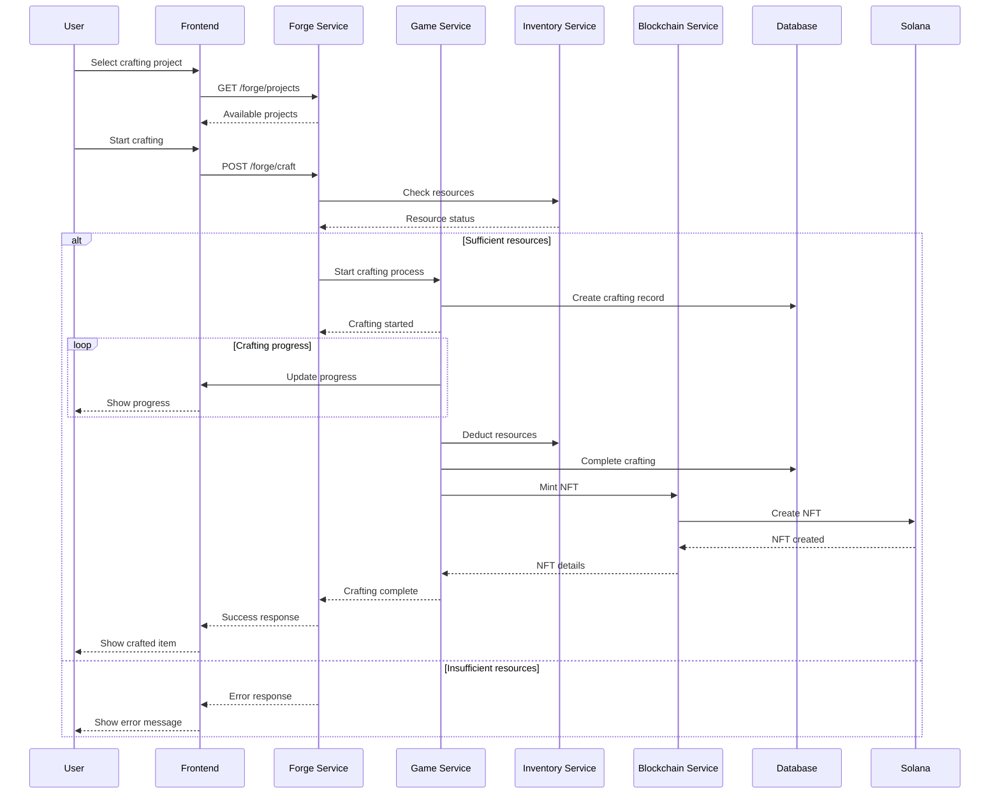
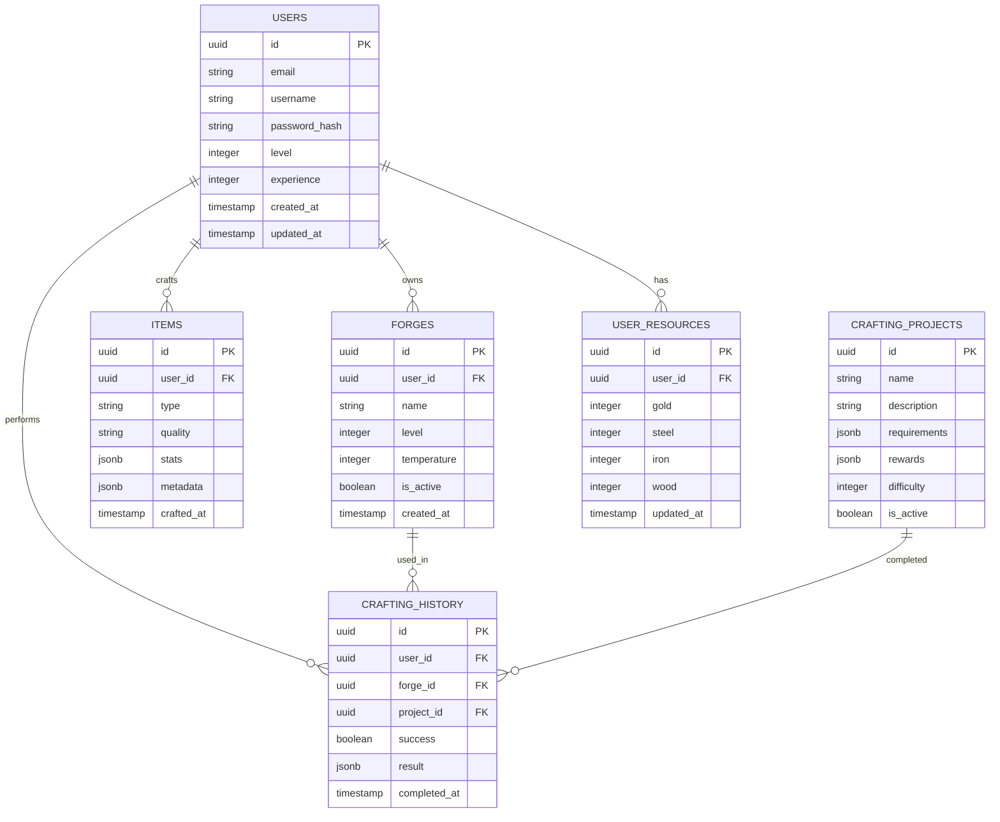
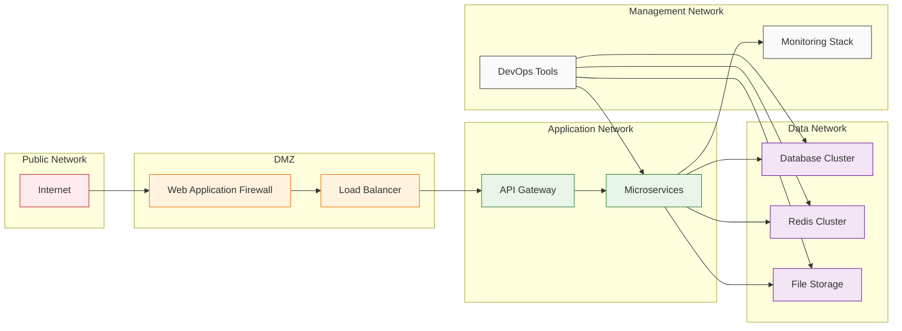
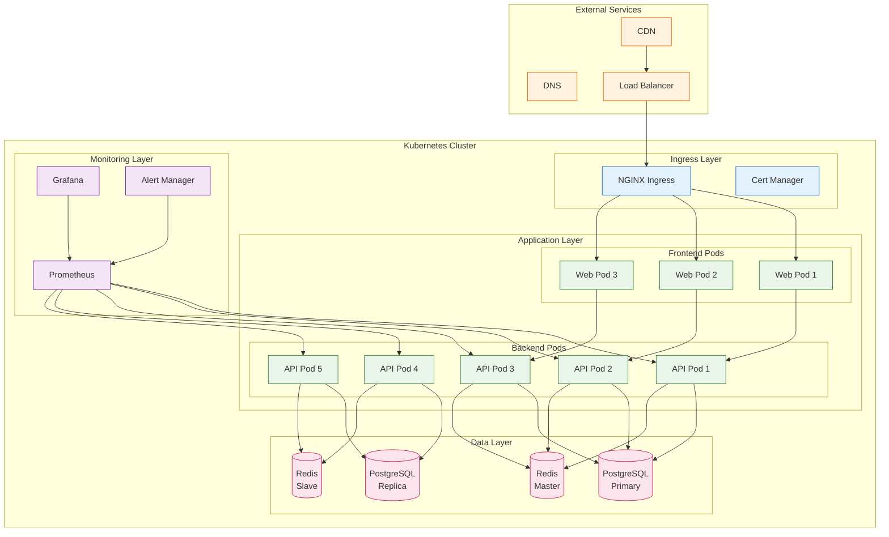
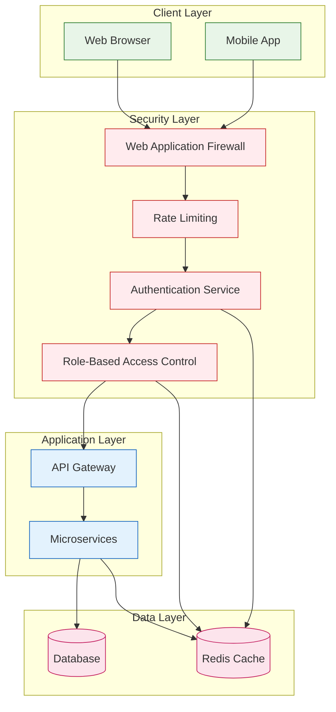
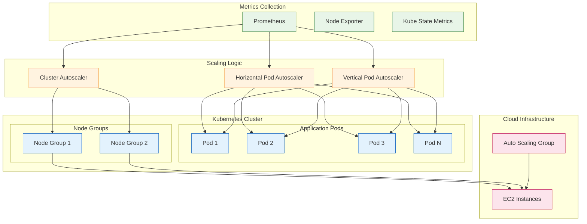

# System Architecture Diagram

**File Path**: `docs/assets/diagrams/system-architecture-diagram.md`  
**Document Type**: Visual Asset - System Architecture Diagram  
**Version**: 1.0  
**Last Updated**: January 2025  
**Status**: Complete  

---

## 🏗️ Complete System Architecture

### **High-Level System Overview**

---

## 🔄 Data Flow Architecture

### **User Authentication Flow**

### **Crafting Flow**

---

## 🗄️ Database Schema Overview

### **Core Entity Relationships**

---

## 🌐 Network Architecture

### **Service Communication Pattern**

---

## 📊 Deployment Architecture

### **Kubernetes Cluster Layout**

---

## 🔐 Security Architecture

### **Authentication & Authorization Flow**

---

## 📈 Performance & Scalability

### **Auto-scaling Architecture**

---

*This diagram provides a comprehensive visual representation of the Engineering Forge system architecture, showing all components, their relationships, and data flow patterns. The diagrams are designed to be easily understood by both technical and non-technical stakeholders.*
