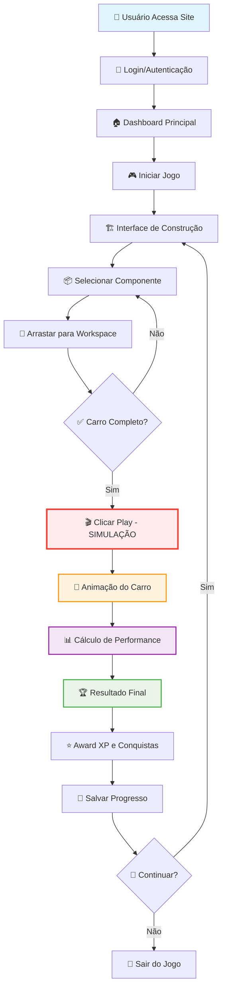
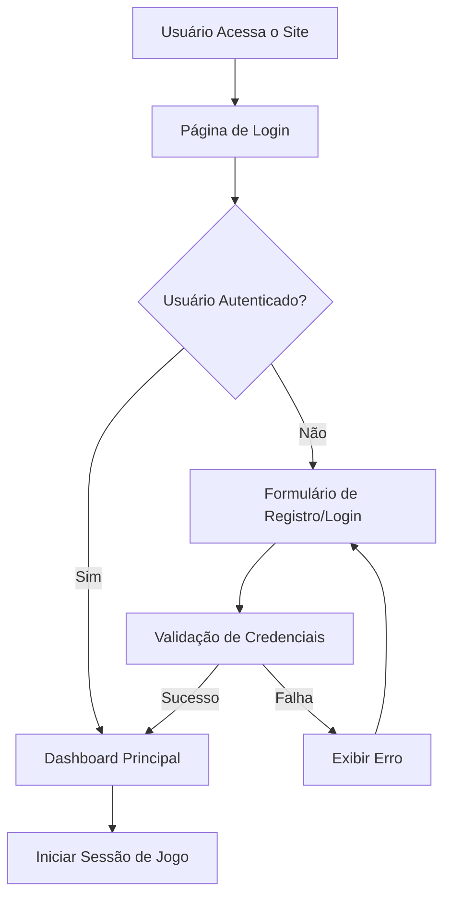
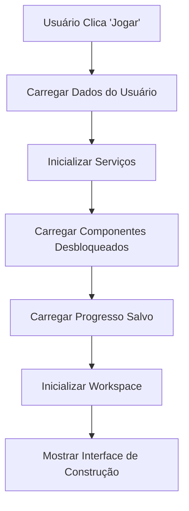
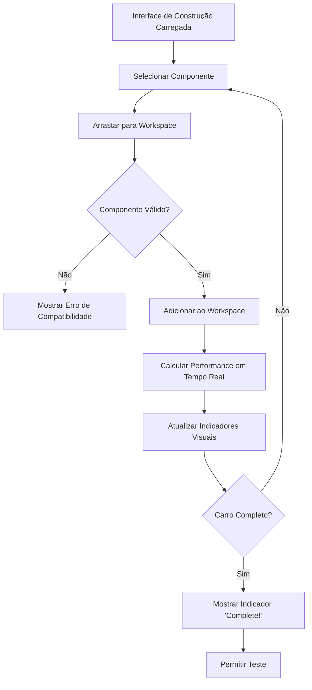
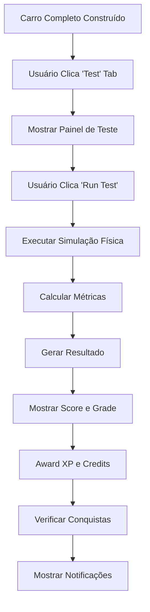
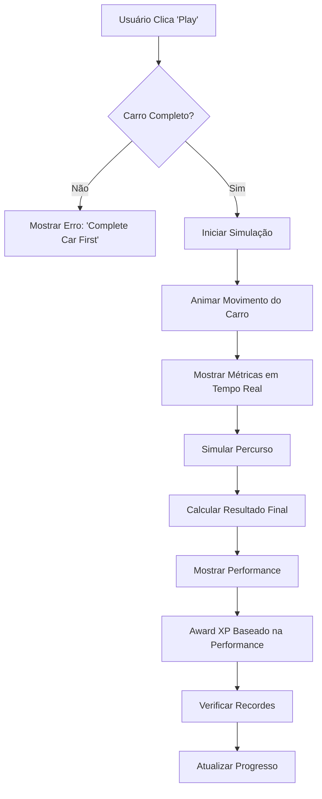
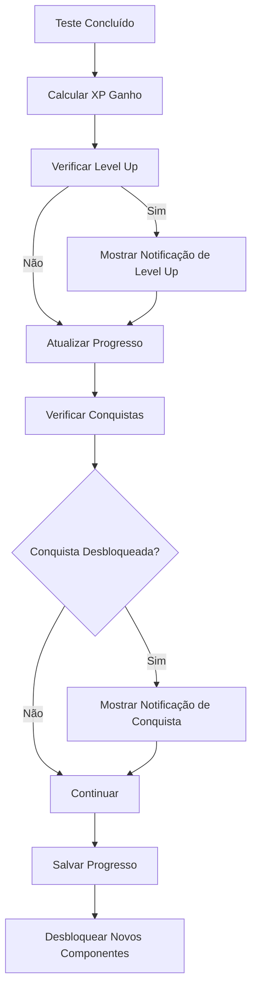
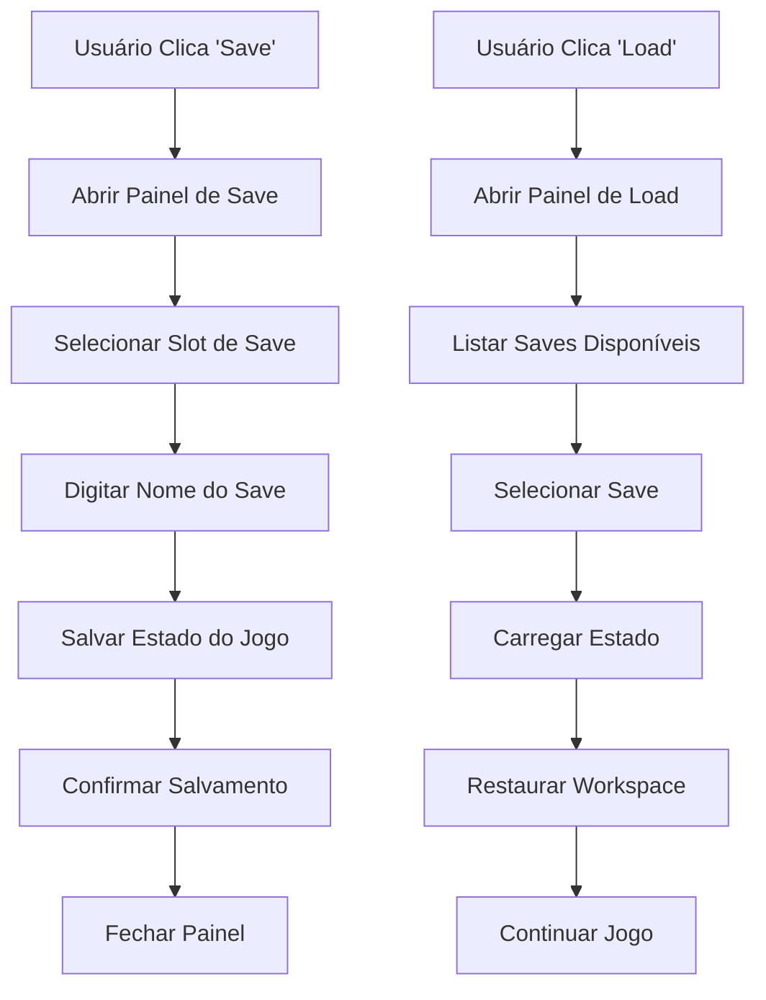
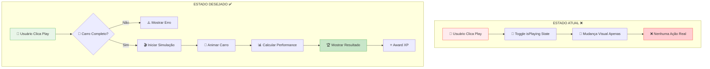
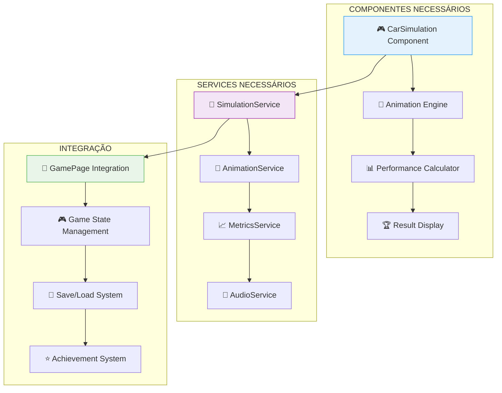

# 🎮 V1.0 User Flow - Engineering Forge

**Versão**: 1.0  
**Data**: Janeiro 2025  
**Status**: 🔄 **Em Desenvolvimento** - Análise Completa do Fluxo Atual

---

## 🎯 **Visão Geral**

Este documento descreve o **fluxo completo do usuário** na V1.0 do Engineering
Forge, desde o acesso inicial até a conclusão de projetos. O documento
identifica o estado atual da implementação e define o que deve acontecer em cada
etapa.

### **Objetivo**

- Documentar o fluxo atual do usuário
- Identificar lacunas na implementação
- Definir ações específicas para cada interação
- Criar base para desenvolvimento do V2.0

### **Escopo**

- **Versão**: V1.0 - Protótipo 2D
- **Foco**: Fluxo de construção e teste de carros
- **Plataforma**: Web (React + TypeScript)

---

## 🚨 **PROBLEMA IDENTIFICADO: Play Button Não Funcional**

### **Estado Atual**

```typescript
// Em GamePage.tsx linha 154-157
const handlePlayPause = useCallback(() => {
  console.log('Play/Pause clicked! Current state:', isPlaying);
  setIsPlaying(prev => !prev); // ❌ APENAS MUDA O ESTADO - SEM AÇÕES
}, [isPlaying]);
```

### **O Que Deveria Acontecer**

O botão Play deveria iniciar uma simulação física do carro construído, mas
atualmente apenas alterna o estado visual.

---

## 🗺️ **Fluxo Completo do Usuário V1.0**

### **Diagrama Geral do Fluxo**



---

## 🗺️ **Fluxo Completo do Usuário V1.0**

### **Fase 1: Acesso e Autenticação**



**Estado Atual**: ⚠️ **PARCIALMENTE IMPLEMENTADO**

- Sistema de autenticação existe mas não está integrado
- Usuário padrão: `user-001` (hardcoded)

**Ações Necessárias**:

1. Integrar sistema de autenticação real
2. Criar página de login/registro
3. Implementar redirecionamento após login

---

### **Fase 2: Inicialização do Jogo**



**Estado Atual**: ✅ **IMPLEMENTADO**

- Serviços inicializados corretamente
- Componentes carregados baseados no nível
- Workspace funcional

**Serviços Inicializados**:

```typescript
// Serviços que são inicializados automaticamente
- ProgressService ✅
- SaveService ✅
- PhysicsSimulationService ✅
- AchievementService ✅
- PerformanceOptimizationService ✅
```

---

### **Fase 3: Construção do Projeto**



**Estado Atual**: ✅ **FUNCIONAL**

- Drag & drop implementado
- Validação de componentes funcionando
- Cálculo de performance em tempo real
- Indicadores visuais funcionando

**Validações Implementadas**:

```typescript
// Verificação de componente único por tipo
const existingComponent = workspaceComponents.find(
  c => c.type === component.type
);
if (existingComponent) {
  alert(`You already have a ${component.type} component!`);
  return;
}
```

**Componentes Necessários para Carro Completo**:

- ✅ Chassis
- ✅ Engine
- ✅ Wheels

---

### **Fase 4: Teste de Performance**



**Estado Atual**: ✅ **IMPLEMENTADO**

- Sistema de teste funcional
- Cálculo de performance implementado
- Sistema de XP e conquistas funcionando

**Métricas Calculadas**:

```typescript
interface PerformanceMetrics {
  acceleration: number; // 0-100 km/h em segundos
  topSpeed: number; // km/h
  handling: number; // 0-100
  fuelEfficiency: number; // km/l
  weight: number; // kg
  power: number; // hp
  torque: number; // Nm
  overall: number; // Score geral
}
```

---

### **Fase 5: Simulação e Animação (PROBLEMA PRINCIPAL)**



**Estado Atual**: ❌ **NÃO IMPLEMENTADO**

- Botão Play apenas muda estado visual
- Sem simulação física ou animação
- Sem feedback visual do carro em movimento

**O Que Está Faltando**:

1. **Simulação Visual**: Animação do carro se movendo
2. **Física em Tempo Real**: Cálculo de movimento baseado em componentes
3. **Feedback Visual**: Indicadores de velocidade, aceleração, etc.
4. **Percurso Simulado**: Um trajeto para o carro percorrer
5. **Resultado Final**: Score baseado na performance real

---

### **Fase 6: Progressão e Conquistas**



**Estado Atual**: ✅ **IMPLEMENTADO**

- Sistema de XP funcionando
- Conquistas sendo desbloqueadas
- Notificações visuais implementadas
- Progresso sendo salvo

---

### **Fase 7: Salvamento e Carregamento**



**Estado Atual**: ✅ **IMPLEMENTADO**

- Sistema de save/load funcional
- Múltiplos slots de save
- Auto-save configurado
- Restauração completa do estado

---

## 🎮 **Fluxo Detalhado por Tab**

### **Tab 1: Build (Construção)**

**Estado**: ✅ **COMPLETO**

**Ações do Usuário**:

1. **Selecionar Componente**: Clicar em componente na paleta
2. **Arrastar**: Mover componente para workspace
3. **Posicionar**: Colocar componente na posição desejada
4. **Remover**: Clicar no X para remover componente
5. **Visualizar**: Ver indicadores de completude

**Feedback Visual**:

- ✅ Indicadores de componentes necessários (chassis, engine, wheels)
- ✅ Contador de componentes
- ✅ Indicador "Complete!" quando carro está pronto
- ✅ Performance calculada em tempo real

### **Tab 2: Test (Teste)**

**Estado**: ✅ **COMPLETO**

**Ações do Usuário**:

1. **Executar Teste**: Clicar em "Run Test"
2. **Ver Resultados**: Visualizar score e grade
3. **Analisar Performance**: Ver métricas detalhadas
4. **Histórico**: Ver testes anteriores

**Funcionalidades**:

- ✅ Teste de performance completo
- ✅ Sistema de pontuação (0-100)
- ✅ Grades (A, B, C, D, F)
- ✅ Histórico de testes
- ✅ Recomendações de melhoria

### **Tab 3: Performance (Performance)**

**Estado**: ✅ **COMPLETO**

**Funcionalidades**:

- ✅ Display de performance atual
- ✅ Métricas em tempo real
- ✅ Histórico de performance
- ✅ Gráficos de evolução

### **Tab 4: Achievements (Conquistas)**

**Estado**: ✅ **COMPLETO**

**Funcionalidades**:

- ✅ Lista de conquistas disponíveis
- ✅ Progresso de cada conquista
- ✅ Conquistas desbloqueadas
- ✅ Sistema de recompensas

---

## 🚨 **PROBLEMAS IDENTIFICADOS**

### **Diagrama: Play Button - Estado Atual vs. Desejado**



### **Problema 1: Play Button Inútil**

**Descrição**: O botão Play não executa nenhuma ação útil.

**Localização**: `GamePage.tsx` linha 538-552

**Código Atual**:

```typescript
<button
  onClick={handlePlayPause}
  className="flex items-center px-4 py-2 bg-blue-600 hover:bg-blue-700 rounded-lg transition-colors"
>
  {isPlaying ? (
    <>
      <Pause className="w-4 h-4 mr-2" />
      Pause
    </>
  ) : (
    <>
      <Play className="w-4 h-4 mr-2" />
      Play
    </>
  )}
</button>
```

**Solução Proposta**:

```typescript
const handlePlayPause = useCallback(() => {
  if (!isCarComplete()) {
    alert('Complete your car first!');
    return;
  }

  if (!isPlaying) {
    startCarSimulation();
  } else {
    stopCarSimulation();
  }

  setIsPlaying(prev => !prev);
}, [isPlaying]);
```

### **Problema 2: Falta de Simulação Visual**

**Descrição**: Não há animação ou simulação visual do carro.

**Solução Necessária**:

1. **Criar componente de simulação visual**
2. **Implementar animação do carro**
3. **Adicionar indicadores de velocidade**
4. **Criar percurso simulado**

### **Problema 3: Integração de Autenticação**

**Descrição**: Sistema de autenticação não está integrado.

**Estado**: Usuário hardcoded como `user-001`

**Solução**: Integrar com sistema de autenticação existente.

---

## 🛠️ **IMPLEMENTAÇÕES NECESSÁRIAS**

### **Diagrama de Implementação**



### **Prioridade Alta**

#### **1. Simulação Visual do Carro**

```typescript
// Novo componente necessário
interface CarSimulationProps {
  components: Component[];
  performance: PerformanceMetrics;
  onSimulationComplete: (result: SimulationResult) => void;
}

const CarSimulation: React.FC<CarSimulationProps> = ({
  components,
  performance,
  onSimulationComplete
}) => {
  // Implementar animação do carro
  // Mostrar indicadores de velocidade
  // Simular percurso
  // Calcular resultado final
};
```

#### **2. Função de Validação de Carro Completo**

```typescript
const isCarComplete = useCallback(() => {
  const hasChassis = workspaceComponents.some(c => c.type === 'chassis');
  const hasEngine = workspaceComponents.some(c => c.type === 'engine');
  const hasWheels = workspaceComponents.some(c => c.type === 'wheels');

  return hasChassis && hasEngine && hasWheels;
}, [workspaceComponents]);
```

#### **3. Sistema de Simulação**

```typescript
const startCarSimulation = useCallback(() => {
  // Iniciar animação
  // Mostrar percurso
  // Executar física em tempo real
  // Calcular resultado baseado na performance
}, []);

const stopCarSimulation = useCallback(() => {
  // Parar animação
  // Pausar simulação
}, []);
```

### **Prioridade Média**

#### **4. Integração de Autenticação**

- Conectar com sistema de login existente
- Remover usuário hardcoded
- Implementar logout

#### **5. Melhorias Visuais**

- Adicionar efeitos de partículas
- Melhorar animações de transição
- Adicionar sons de simulação

### **Prioridade Baixa**

#### **6. Funcionalidades Avançadas**

- Múltiplos percursos
- Diferentes condições climáticas
- Modo de câmera livre
- Export de resultados

---

## 📊 **Métricas de Sucesso do Fluxo**

### **Métricas de Usabilidade**

- **Tempo para primeiro carro**: < 5 minutos
- **Taxa de conclusão**: > 80%
- **Tempo médio de sessão**: > 15 minutos
- **Taxa de retorno**: > 70%

### **Métricas Técnicas**

- **Tempo de carregamento**: < 2 segundos
- **FPS durante simulação**: > 30fps
- **Tempo de resposta**: < 100ms
- **Taxa de erro**: < 1%

### **Métricas de Engajamento**

- **Projetos completados**: > 3 por sessão
- **Testes executados**: > 5 por sessão
- **Conquistas desbloqueadas**: > 2 por sessão
- **Feedback positivo**: > 4.0/5

---

## 🔄 **Fluxo de Desenvolvimento Recomendado**

### **Sprint 1: Correção do Play Button (1 semana)**

1. Implementar validação de carro completo
2. Criar sistema básico de simulação
3. Adicionar feedback visual simples
4. Testar funcionalidade básica

### **Sprint 2: Simulação Visual (2 semanas)**

1. Desenvolver componente de simulação
2. Implementar animação do carro
3. Criar percurso simulado
4. Adicionar indicadores visuais

### **Sprint 3: Polimento e Integração (1 semana)**

1. Integrar autenticação
2. Melhorar feedback visual
3. Adicionar efeitos sonoros
4. Otimizar performance

### **Sprint 4: Testes e Refinamento (1 semana)**

1. Testes de usabilidade
2. Correção de bugs
3. Otimizações finais
4. Documentação

---

## 📋 **Checklist de Implementação**

### **Funcionalidades Core**

- [ ] Validação de carro completo
- [ ] Simulação visual básica
- [ ] Animação do carro
- [ ] Indicadores de performance
- [ ] Resultado final da simulação

### **Melhorias de UX**

- [ ] Feedback visual melhorado
- [ ] Mensagens de erro claras
- [ ] Loading states
- [ ] Confirmações de ação

### **Integração**

- [ ] Sistema de autenticação
- [ ] Salvamento de simulações
- [ ] Histórico de resultados
- [ ] Compartilhamento de resultados

### **Performance**

- [ ] Otimização de renderização
- [ ] Gerenciamento de memória
- [ ] Lazy loading
- [ ] Cache de componentes

---

## 🎯 **Próximos Passos**

### **Imediato (Esta Semana)**

1. **Implementar validação de carro completo**
2. **Criar função básica de simulação**
3. **Adicionar feedback visual ao Play button**
4. **Testar funcionalidade básica**

### **Curto Prazo (Próximas 2 Semanas)**

1. **Desenvolver simulação visual completa**
2. **Implementar animação do carro**
3. **Criar sistema de percurso**
4. **Integrar com sistema de XP**

### **Médio Prazo (Próximo Mês)**

1. **Integrar autenticação real**
2. **Adicionar funcionalidades avançadas**
3. **Otimizar performance**
4. **Preparar para V2.0**

---

## 📞 **Contatos e Responsabilidades**

### **Desenvolvimento**

- **Frontend Dev**: Implementar simulação visual
- **Game Dev**: Desenvolver mecânicas de simulação
- **UX Designer**: Melhorar feedback visual

### **Testes**

- **QA Engineer**: Testar fluxo completo
- **Beta Testers**: Validar usabilidade
- **Performance Tester**: Otimizar performance

---

_Este documento é atualizado regularmente. Última atualização: Janeiro 2025_

**Status**: 🟡 **ANÁLISE COMPLETA** | **Próxima Revisão**: Após implementação
das correções

**Don't forget to commit** 🚀
