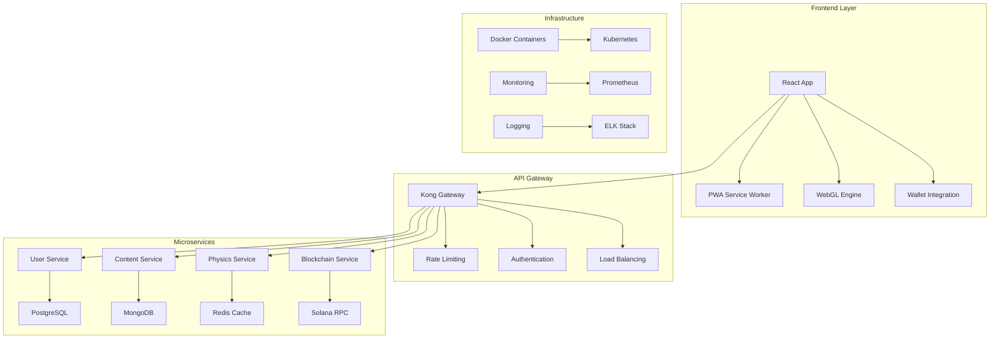

# Documento de Design Técnico: Game University: Engineering Forge
**Versão**: 1.1  
**Data**: Janeiro 2025  
**Projeto**: Engineering Guild  
**Contato**: @engineeringguild (X)  
**Website**: guildeng.com/EngineeringForge  

---

## 📋 Índice

1. [Resumo Executivo](#resumo-executivo)
2. [Arquitetura do Sistema](#arquitetura-do-sistema)
3. [Stack Tecnológico](#stack-tecnológico)
4. [Design do Banco de Dados](#design-do-banco-de-dados)
5. [Design da API](#design-da-api)
6. [Arquitetura Frontend](#arquitetura-frontend)
7. [Arquitetura Backend](#arquitetura-backend)
8. [Integração Blockchain](#integração-blockchain)
9. [Arquitetura de Segurança](#arquitetura-de-segurança)
10. [Performance & Escalabilidade](#performance--escalabilidade)
11. [DevOps & Deploy](#devops--deploy)
12. [Estratégia de Testes](#estratégia-de-testes)
13. [Monitoramento & Analytics](#monitoramento--analytics)
14. [Fluxo de Desenvolvimento](#fluxo-de-desenvolvimento)
15. [Apêndices](#apêndices)

---

## 🎯 Resumo Executivo

### **Visão Técnica**
*Game University: Engineering Forge* requer uma aplicação web robusta e escalável que combine entrega de conteúdo educacional, simulação de física em tempo real e integração blockchain. O sistema deve suportar milhares de usuários concorrentes mantendo tempos de resposta sub-segundo e fornecendo capacidades de cunhagem de NFT sem interrupções.

### **Requisitos Técnicos Principais**
- **Simulação de Física em Tempo Real**: Renderização 3D baseada em WebGL com cálculos de física precisos
- **Integração Blockchain**: Cunhagem de NFT Solana e gerenciamento de carteira
- **Gestão de Conteúdo Educacional**: Entrega dinâmica de currículo e rastreamento de progresso
- **Arquitetura Escalável**: Backend baseado em microsserviços com escalonamento horizontal
- **Suporte Multiplataforma**: Progressive Web App (PWA) com otimização móvel

### **Desafios Técnicos**
1. **Performance**: Simulação de física 3D em tempo real em navegadores web
2. **Escalabilidade**: Lidar com 10.000+ usuários concorrentes
3. **Integração Blockchain**: Integração perfeita de carteira Solana e cunhagem de NFT
4. **Conteúdo Educacional**: Gestão dinâmica de currículo e avaliação
5. **Segurança**: Proteção de dados do usuário e segurança de transações blockchain

---

## 🏗️ Arquitetura do Sistema

### **Visão Geral da Arquitetura**



### **Princípios Arquiteturais**
- **Separação de Responsabilidades**: Cada microsserviço tem uma responsabilidade específica
- **Escalabilidade**: Escalonamento horizontal através de containerização
- **Resilência**: Tolerância a falhas através de circuit breakers e retry patterns
- **Observabilidade**: Logging, métricas e tracing abrangentes
- **Segurança**: Segurança por design com múltiplas camadas de proteção

### **Padrões de Design**
- **Event-Driven Architecture**: Comunicação assíncrona através de message queues
- **CQRS**: Separação de Command e Query para otimização de performance
- **API-First**: Design de API antes da implementação
- **Domain-Driven Design**: Modelagem baseada em domínios de negócio
- **Clean Architecture**: Separação clara entre camadas de negócio e infraestrutura

---

## 💻 Stack Tecnológico

### **Frontend**
```typescript
// Tecnologias Principais
const frontendStack = {
  framework: "React 18",
  language: "TypeScript 5.0",
  stateManagement: "Zustand",
  styling: "Tailwind CSS",
  graphics3D: "Three.js",
  buildTool: "Vite",
  testing: "Vitest + React Testing Library",
  pwa: "Workbox"
};
```

### **Backend**
```typescript
// Microsserviços
const backendStack = {
  runtime: "Node.js 20 LTS",
  framework: "Express.js",
  language: "TypeScript",
  database: {
    primary: "PostgreSQL 15",
    cache: "Redis 7",
    documents: "MongoDB 6"
  },
  messageQueue: "RabbitMQ",
  authentication: "JWT + OAuth2",
  validation: "Zod"
};
```

### **Blockchain**
```rust
// Integração Solana
pub struct BlockchainStack {
    pub network: "Solana Mainnet/Devnet",
    pub framework: "Anchor Framework",
    pub client: "@solana/web3.js",
    pub wallet_adapter: "Solana Wallet Adapter",
    pub nft_standard: "Metaplex Token Metadata",
    pub storage: "Arweave/IPFS"
}
```

### **DevOps & Infraestrutura**
```yaml
# Configuração de Infraestrutura
infrastructure:
  containers: Docker
  orchestration: Kubernetes
  cloud: AWS/GCP
  cdn: Cloudflare
  monitoring: Prometheus + Grafana
  logging: ELK Stack
  ci_cd: GitHub Actions
  security: Vault + Cert-Manager
```

### **Ferramentas de Desenvolvimento**
- **IDE**: VS Code com extensões TypeScript
- **Versionamento**: Git com GitFlow
- **Qualidade de Código**: ESLint, Prettier, Husky
- **Documentação**: TypeDoc, Storybook
- **API Documentation**: OpenAPI 3.0

---

## 🗄️ Design do Banco de Dados

### **Esquema Principal (PostgreSQL)**

```sql
-- Tabela de Usuários
CREATE TABLE users (
    id UUID PRIMARY KEY DEFAULT gen_random_uuid(),
    email VARCHAR(255) UNIQUE NOT NULL,
    username VARCHAR(50) UNIQUE NOT NULL,
    wallet_address VARCHAR(44),
    profile_data JSONB,
    preferences JSONB,
    created_at TIMESTAMP DEFAULT NOW(),
    updated_at TIMESTAMP DEFAULT NOW(),
    last_login TIMESTAMP,
    is_active BOOLEAN DEFAULT true
);

-- Tabela de Projetos
CREATE TABLE projects (
    id UUID PRIMARY KEY DEFAULT gen_random_uuid(),
    user_id UUID REFERENCES users(id) ON DELETE CASCADE,
    title VARCHAR(255) NOT NULL,
    description TEXT,
    module_type VARCHAR(50) NOT NULL,
    components JSONB NOT NULL,
    performance_metrics JSONB,
    design_data JSONB,
    nft_token_id VARCHAR(44),
    is_public BOOLEAN DEFAULT false,
    version INTEGER DEFAULT 1,
    created_at TIMESTAMP DEFAULT NOW(),
    updated_at TIMESTAMP DEFAULT NOW()
);

-- Tabela de Conquistas
CREATE TABLE achievements (
    id UUID PRIMARY KEY DEFAULT gen_random_uuid(),
    user_id UUID REFERENCES users(id) ON DELETE CASCADE,
    achievement_type VARCHAR(50) NOT NULL,
    title VARCHAR(255) NOT NULL,
    description TEXT,
    metadata JSONB,
    nft_token_id VARCHAR(44),
    earned_at TIMESTAMP DEFAULT NOW(),
    is_verified BOOLEAN DEFAULT false
);

-- Tabela de Progresso do Curso
CREATE TABLE course_progress (
    id UUID PRIMARY KEY DEFAULT gen_random_uuid(),
    user_id UUID REFERENCES users(id) ON DELETE CASCADE,
    course_id VARCHAR(100) NOT NULL,
    module_id VARCHAR(100) NOT NULL,
    section_id VARCHAR(100) NOT NULL,
    progress_percentage INTEGER DEFAULT 0,
    completion_data JSONB,
    started_at TIMESTAMP DEFAULT NOW(),
    completed_at TIMESTAMP,
    UNIQUE(user_id, course_id, module_id, section_id)
);

-- Tabela de Colaboração
CREATE TABLE collaborations (
    id UUID PRIMARY KEY DEFAULT gen_random_uuid(),
    project_id UUID REFERENCES projects(id) ON DELETE CASCADE,
    owner_id UUID REFERENCES users(id) ON DELETE CASCADE,
    collaborator_id UUID REFERENCES users(id) ON DELETE CASCADE,
    permission_level VARCHAR(20) DEFAULT 'read',
    invited_at TIMESTAMP DEFAULT NOW(),
    accepted_at TIMESTAMP,
    is_active BOOLEAN DEFAULT true
);
```

### **Índices para Performance**
```sql
-- Índices para otimização de consultas
CREATE INDEX idx_users_email ON users(email);
CREATE INDEX idx_users_wallet ON users(wallet_address);
CREATE INDEX idx_projects_user_id ON projects(user_id);
CREATE INDEX idx_projects_module_type ON projects(module_type);
CREATE INDEX idx_achievements_user_id ON achievements(user_id);
CREATE INDEX idx_course_progress_user_course ON course_progress(user_id, course_id);
CREATE INDEX idx_collaborations_project ON collaborations(project_id);

-- Índices compostos para consultas complexas
CREATE INDEX idx_projects_user_public ON projects(user_id, is_public);
CREATE INDEX idx_achievements_type_verified ON achievements(achievement_type, is_verified);
```

### **Cache Strategy (Redis)**
```typescript
// Estratégia de Cache
interface CacheStrategy {
  userSessions: "30 minutes"; // Sessões de usuário
  projectData: "1 hour";     // Dados de projeto
  courseContent: "24 hours"; // Conteúdo educacional
  leaderboards: "5 minutes"; // Rankings e leaderboards
  nftMetadata: "12 hours";   // Metadados NFT
}
```

---

## 🔌 Design da API

### **Arquitetura RESTful**

#### **Endpoints de Autenticação**
```typescript
// Autenticação e Autorização
POST   /api/v1/auth/login
POST   /api/v1/auth/register
POST   /api/v1/auth/refresh
DELETE /api/v1/auth/logout
POST   /api/v1/auth/wallet/connect
POST   /api/v1/auth/wallet/verify
```

#### **Endpoints de Usuário**
```typescript
// Gestão de Usuários
GET    /api/v1/users/profile
PUT    /api/v1/users/profile
GET    /api/v1/users/achievements
GET    /api/v1/users/projects
GET    /api/v1/users/progress
PUT    /api/v1/users/preferences
```

#### **Endpoints de Projeto**
```typescript
// Sistema de Projetos
GET    /api/v1/projects
POST   /api/v1/projects
GET    /api/v1/projects/:id
PUT    /api/v1/projects/:id
DELETE /api/v1/projects/:id
POST   /api/v1/projects/:id/collaborate
POST   /api/v1/projects/:id/fork
POST   /api/v1/projects/:id/simulate
```

#### **Endpoints de Conteúdo**
```typescript
// Conteúdo Educacional
GET    /api/v1/courses
GET    /api/v1/courses/:courseId/modules
GET    /api/v1/courses/:courseId/modules/:moduleId
POST   /api/v1/courses/:courseId/modules/:moduleId/progress
GET    /api/v1/courses/:courseId/leaderboard
```

#### **Endpoints Blockchain**
```typescript
// Integração Blockchain
POST   /api/v1/nft/mint
GET    /api/v1/nft/:tokenId
POST   /api/v1/nft/:tokenId/transfer
GET    /api/v1/wallet/balance
GET    /api/v1/wallet/transactions
POST   /api/v1/marketplace/list
```

### **Modelos de Dados**

#### **Modelo de Projeto**
```typescript
interface Project {
  id: string;
  userId: string;
  title: string;
  description: string;
  moduleType: 'mechanical' | 'electrical' | 'civil' | 'software' | 'aerospace';
  components: Component[];
  performanceMetrics: PerformanceMetrics;
  designData: DesignData;
  nftTokenId?: string;
  isPublic: boolean;
  version: number;
  collaborators: Collaborator[];
  createdAt: Date;
  updatedAt: Date;
}

interface Component {
  id: string;
  type: string;
  position: Vector3;
  rotation: Quaternion;
  scale: Vector3;
  properties: Record<string, any>;
  connections: Connection[];
  materials: Material[];
}

interface PerformanceMetrics {
  efficiency: number;
  power: number;
  weight: number;
  cost: number;
  environmentalImpact: number;
  safetyRating: number;
}
```

#### **Modelo de Usuário**
```typescript
interface User {
  id: string;
  email: string;
  username: string;
  walletAddress?: string;
  profile: UserProfile;
  preferences: UserPreferences;
  achievements: Achievement[];
  courseProgress: CourseProgress[];
  createdAt: Date;
  updatedAt: Date;
  lastLogin: Date;
  isActive: boolean;
}

interface UserProfile {
  firstName: string;
  lastName: string;
  avatar: string;
  bio: string;
  location: string;
  engineeringDisciplines: string[];
  skillLevel: 'beginner' | 'intermediate' | 'advanced' | 'expert';
  socialLinks: SocialLink[];
}
```

### **Validação e Segurança**
```typescript
// Validação com Zod
import { z } from 'zod';

const createProjectSchema = z.object({
  title: z.string().min(3).max(255),
  description: z.string().max(1000).optional(),
  moduleType: z.enum(['mechanical', 'electrical', 'civil', 'software', 'aerospace']),
  components: z.array(componentSchema).min(1),
  isPublic: z.boolean().default(false)
});

// Middleware de autenticação
const authMiddleware = async (req: Request, res: Response, next: NextFunction) => {
  try {
    const token = req.headers.authorization?.split(' ')[1];
    if (!token) throw new Error('Token não fornecido');
    
    const decoded = jwt.verify(token, process.env.JWT_SECRET!);
    req.user = decoded;
    next();
  } catch (error) {
    res.status(401).json({ error: 'Token inválido' });
  }
};
```

---

## ⚛️ Arquitetura Frontend

### **Estrutura de Componentes**
```
src/
├── components/
│   ├── Layout/
│   │   ├── Header.tsx
│   │   ├── Sidebar.tsx
│   │   ├── Footer.tsx
│   │   └── MainLayout.tsx
│   ├── UI/
│   │   ├── Button/
│   │   ├── Modal/
│   │   ├── Form/
│   │   └── LoadingSpinner/
│   ├── Features/
│   │   ├── DesignEditor/
│   │   ├── PhysicsSimulation/
│   │   ├── CourseViewer/
│   │   └── WalletIntegration/
│   └── Common/
│       ├── ErrorBoundary/
│       └── ProtectedRoute/
├── hooks/
│   ├── useAuth.ts
│   ├── useProjects.ts
│   ├── useWallet.ts
│   └── usePhysics.ts
├── stores/
│   ├── authStore.ts
│   ├── projectStore.ts
│   ├── uiStore.ts
│   └── walletStore.ts
├── services/
│   ├── api.ts
│   ├── blockchain.ts
│   └── physics.ts
└── utils/
    ├── constants.ts
    ├── helpers.ts
    └── validators.ts
```

### **Gestão de Estado com Zustand**
```typescript
// Store de Projetos
interface ProjectStore {
  projects: Project[];
  currentProject: Project | null;
  isLoading: boolean;
  error: string | null;
  
  // Actions
  fetchProjects: () => Promise<void>;
  createProject: (data: CreateProjectData) => Promise<void>;
  updateProject: (id: string, data: Partial<Project>) => Promise<void>;
  deleteProject: (id: string) => Promise<void>;
  setCurrentProject: (project: Project | null) => void;
  simulateProject: (projectId: string) => Promise<SimulationResult>;
}

export const useProjectStore = create<ProjectStore>()((set, get) => ({
  projects: [],
  currentProject: null,
  isLoading: false,
  error: null,
  
  fetchProjects: async () => {
    set({ isLoading: true, error: null });
    try {
      const projects = await api.getProjects();
      set({ projects, isLoading: false });
    } catch (error) {
      set({ error: error.message, isLoading: false });
    }
  },
  
  createProject: async (data) => {
    set({ isLoading: true, error: null });
    try {
      const project = await api.createProject(data);
      set(state => ({ 
        projects: [...state.projects, project],
        currentProject: project,
        isLoading: false 
      }));
    } catch (error) {
      set({ error: error.message, isLoading: false });
    }
  },
  
  // ... outras actions
}));
```

### **Sistema de Roteamento**
```typescript
// Configuração de Rotas
import { createBrowserRouter } from 'react-router-dom';

export const router = createBrowserRouter([
  {
    path: '/',
    element: <MainLayout />,
    children: [
      {
        index: true,
        element: <Dashboard />
      },
      {
        path: 'courses',
        children: [
          {
            index: true,
            element: <CourseList />
          },
          {
            path: ':courseId',
            element: <CourseDetail />
          },
          {
            path: ':courseId/modules/:moduleId',
            element: <ModuleViewer />
          }
        ]
      },
      {
        path: 'projects',
        children: [
          {
            index: true,
            element: <ProjectList />
          },
          {
            path: 'new',
            element: <ProjectEditor />
          },
          {
            path: ':projectId',
            element: <ProjectDetail />
          },
          {
            path: ':projectId/edit',
            element: <ProjectEditor />
          }
        ]
      },
      {
        path: 'profile',
        element: <ProtectedRoute><UserProfile /></ProtectedRoute>
      }
    ]
  },
  {
    path: '/auth',
    children: [
      {
        path: 'login',
        element: <Login />
      },
      {
        path: 'register',
        element: <Register />
      }
    ]
  }
]);
```

### **Integração WebGL/Three.js**
```typescript
// Hook de Física 3D
export const usePhysicsEngine = () => {
  const [scene, setScene] = useState<THREE.Scene | null>(null);
  const [renderer, setRenderer] = useState<THREE.WebGLRenderer | null>(null);
  const [physics, setPhysics] = useState<PhysicsWorld | null>(null);
  
  const initializeEngine = useCallback((canvas: HTMLCanvasElement) => {
    // Configurar Three.js
    const newScene = new THREE.Scene();
    const newRenderer = new THREE.WebGLRenderer({ canvas, antialias: true });
    const camera = new THREE.PerspectiveCamera(75, window.innerWidth / window.innerHeight, 0.1, 1000);
    
    // Configurar física
    const world = new CANNON.World();
    world.gravity.set(0, -9.82, 0);
    
    setScene(newScene);
    setRenderer(newRenderer);
    setPhysics(world);
  }, []);
  
  const addComponent = useCallback((component: Component) => {
    if (!scene || !physics) return;
    
    // Criar geometria Three.js
    const geometry = createGeometry(component);
    const material = createMaterial(component.materials);
    const mesh = new THREE.Mesh(geometry, material);
    
    // Adicionar corpo físico
    const body = createPhysicsBody(component);
    physics.addBody(body);
    
    scene.add(mesh);
  }, [scene, physics]);
  
  return {
    scene,
    renderer,
    physics,
    initializeEngine,
    addComponent
  };
};
```

---

## 🔧 Arquitetura Backend

### **Microsserviços**

#### **User Service**
```typescript
// Serviço de Usuários
@Controller('/api/v1/users')
export class UserController {
  constructor(
    private userService: UserService,
    private authService: AuthService
  ) {}
  
  @Get('/profile')
  @UseGuards(JwtAuthGuard)
  async getProfile(@Req() req: AuthenticatedRequest) {
    return await this.userService.getProfile(req.user.id);
  }
  
  @Put('/profile')
  @UseGuards(JwtAuthGuard)
  @UsePipes(new ValidationPipe())
  async updateProfile(
    @Req() req: AuthenticatedRequest,
    @Body() updateData: UpdateProfileDto
  ) {
    return await this.userService.updateProfile(req.user.id, updateData);
  }
  
  @Get('/achievements')
  @UseGuards(JwtAuthGuard)
  async getAchievements(@Req() req: AuthenticatedRequest) {
    return await this.userService.getAchievements(req.user.id);
  }
}
```

#### **Project Service**
```typescript
// Serviço de Projetos
@Injectable()
export class ProjectService {
  constructor(
    @InjectRepository(Project)
    private projectRepository: Repository<Project>,
    private physicsService: PhysicsService,
    private nftService: NftService
  ) {}
  
  async createProject(userId: string, data: CreateProjectDto): Promise<Project> {
    const project = this.projectRepository.create({
      ...data,
      userId,
      version: 1
    });
    
    await this.projectRepository.save(project);
    
    // Executar simulação inicial
    const metrics = await this.physicsService.simulate(project.components);
    project.performanceMetrics = metrics;
    
    return await this.projectRepository.save(project);
  }
  
  async simulateProject(projectId: string): Promise<SimulationResult> {
    const project = await this.projectRepository.findOne({
      where: { id: projectId }
    });
    
    if (!project) {
      throw new NotFoundException('Projeto não encontrado');
    }
    
    return await this.physicsService.simulate(project.components);
  }
  
  async mintProjectNFT(projectId: string, userId: string): Promise<string> {
    const project = await this.getProject(projectId, userId);
    
    if (project.nftTokenId) {
      throw new BadRequestException('NFT já foi cunhado para este projeto');
    }
    
    const tokenId = await this.nftService.mintProject(project);
    
    project.nftTokenId = tokenId;
    await this.projectRepository.save(project);
    
    return tokenId;
  }
}
```

#### **Physics Service**
```typescript
// Serviço de Física
@Injectable()
export class PhysicsService {
  private physicsWorkers: Worker[] = [];
  
  constructor() {
    // Inicializar workers para processamento paralelo
    for (let i = 0; i < os.cpus().length; i++) {
      const worker = new Worker('./physics-worker.js');
      this.physicsWorkers.push(worker);
    }
  }
  
  async simulate(components: Component[]): Promise<SimulationResult> {
    return new Promise((resolve, reject) => {
      const worker = this.getAvailableWorker();
      
      worker.postMessage({
        type: 'SIMULATE',
        components,
        timestamp: Date.now()
      });
      
      worker.onmessage = (event) => {
        if (event.data.type === 'SIMULATION_COMPLETE') {
          resolve(event.data.result);
        } else if (event.data.type === 'SIMULATION_ERROR') {
          reject(new Error(event.data.error));
        }
      };
      
      // Timeout após 30 segundos
      setTimeout(() => {
        reject(new Error('Simulação excedeu tempo limite'));
      }, 30000);
    });
  }
  
  private getAvailableWorker(): Worker {
    // Implementar load balancing simples
    return this.physicsWorkers[Math.floor(Math.random() * this.physicsWorkers.length)];
  }
}
```

### **Message Queue (RabbitMQ)**
```typescript
// Configuração de Filas de Mensagem
@Injectable()
export class MessageQueueService {
  constructor(@InjectAmqpConnection() private amqp: AmqpConnection) {}
  
  // Publicar evento de projeto criado
  async publishProjectCreated(project: Project) {
    await this.amqp.publish('project.events', 'project.created', {
      projectId: project.id,
      userId: project.userId,
      timestamp: new Date()
    });
  }
  
  // Consumir eventos de simulação
  @RabbitSubscribe({
    exchange: 'simulation.events',
    routingKey: 'simulation.requested'
  })
  async handleSimulationRequest(message: SimulationRequest) {
    const result = await this.physicsService.simulate(message.components);
    
    await this.amqp.publish('simulation.events', 'simulation.completed', {
      requestId: message.requestId,
      result,
      timestamp: new Date()
    });
  }
}
```

---

## ⛓️ Integração Blockchain

### **Smart Contracts Solana**
```rust
// Programa Solana para Credenciais de Engenharia
use anchor_lang::prelude::*;
use anchor_spl::token::{self, Token, TokenAccount, Mint};

declare_id!("EngineeringForge11111111111111111111111111");

#[program]
pub mod engineering_forge {
    use super::*;
    
    pub fn mint_project_nft(
        ctx: Context<MintProjectNft>,
        project_data: ProjectData,
        uri: String,
    ) -> Result<()> {
        let project_nft = &mut ctx.accounts.project_nft;
        
        project_nft.owner = ctx.accounts.owner.key();
        project_nft.project_id = project_data.id;
        project_nft.module_type = project_data.module_type;
        project_nft.performance_score = project_data.performance_score;
        project_nft.components_hash = project_data.components_hash;
        project_nft.mint_timestamp = Clock::get()?.unix_timestamp;
        project_nft.uri = uri;
        
        // Cunhar NFT usando Metaplex
        let cpi_accounts = token::MintTo {
            mint: ctx.accounts.mint.to_account_info(),
            to: ctx.accounts.token_account.to_account_info(),
            authority: ctx.accounts.mint_authority.to_account_info(),
        };
        
        let cpi_program = ctx.accounts.token_program.to_account_info();
        let cpi_ctx = CpiContext::new(cpi_program, cpi_accounts);
        
        token::mint_to(cpi_ctx, 1)?;
        
        emit!(ProjectNftMinted {
            project_id: project_data.id,
            owner: ctx.accounts.owner.key(),
            mint: ctx.accounts.mint.key(),
            performance_score: project_data.performance_score,
        });
        
        Ok(())
    }
    
    pub fn mint_diploma_nft(
        ctx: Context<MintDiplomaNft>,
        diploma_data: DiplomaData,
        uri: String,
    ) -> Result<()> {
        let diploma_nft = &mut ctx.accounts.diploma_nft;
        
        diploma_nft.owner = ctx.accounts.owner.key();
        diploma_nft.degree_level = diploma_data.degree_level;
        diploma_nft.discipline = diploma_data.discipline;
        diploma_nft.gpa = diploma_data.gpa;
        diploma_nft.completion_date = Clock::get()?.unix_timestamp;
        diploma_nft.uri = uri;
        
        // Verificar se o usuário completou os requisitos
        require!(
            diploma_data.completed_modules >= diploma_data.required_modules,
            ErrorCode::InsufficientModulesCompleted
        );
        
        // Cunhar diploma NFT
        let cpi_accounts = token::MintTo {
            mint: ctx.accounts.mint.to_account_info(),
            to: ctx.accounts.token_account.to_account_info(),
            authority: ctx.accounts.mint_authority.to_account_info(),
        };
        
        let cpi_program = ctx.accounts.token_program.to_account_info();
        let cpi_ctx = CpiContext::new(cpi_program, cpi_accounts);
        
        token::mint_to(cpi_ctx, 1)?;
        
        emit!(DiplomaNftMinted {
            owner: ctx.accounts.owner.key(),
            mint: ctx.accounts.mint.key(),
            degree_level: diploma_data.degree_level,
            discipline: diploma_data.discipline,
        });
        
        Ok(())
    }
}

#[derive(Accounts)]
pub struct MintProjectNft<'info> {
    #[account(
        init,
        payer = owner,
        space = 8 + ProjectNft::INIT_SPACE,
        seeds = [b"project_nft", owner.key().as_ref(), project_id.as_bytes()],
        bump
    )]
    pub project_nft: Account<'info, ProjectNft>,
    
    #[account(mut)]
    pub owner: Signer<'info>,
    
    #[account(
        init,
        payer = owner,
        mint::decimals = 0,
        mint::authority = mint_authority,
    )]
    pub mint: Account<'info, Mint>,
    
    /// CHECK: Mint authority PDA
    #[account(
        seeds = [b"mint_authority"],
        bump
    )]
    pub mint_authority: UncheckedAccount<'info>,
    
    #[account(
        init,
        payer = owner,
        associated_token::mint = mint,
        associated_token::authority = owner
    )]
    pub token_account: Account<'info, TokenAccount>,
    
    pub token_program: Program<'info, Token>,
    pub system_program: Program<'info, System>,
    pub rent: Sysvar<'info, Rent>,
}

#[account]
pub struct ProjectNft {
    pub owner: Pubkey,
    pub project_id: String,
    pub module_type: ModuleType,
    pub performance_score: u16,
    pub components_hash: [u8; 32],
    pub mint_timestamp: i64,
    pub uri: String,
}

#[derive(AnchorSerialize, AnchorDeserialize, Clone, PartialEq, Eq)]
pub enum ModuleType {
    Mechanical,
    Electrical,
    Civil,
    Software,
    Aerospace,
}
```

### **Integração Frontend Wallet**
```typescript
// Hook de Integração Wallet
import { useWallet, useConnection } from '@solana/wallet-adapter-react';
import { PublicKey, Transaction } from '@solana/web3.js';

export const useEngineeringForge = () => {
  const { publicKey, signTransaction } = useWallet();
  const { connection } = useConnection();
  
  const mintProjectNFT = async (projectData: ProjectData): Promise<string> => {
    if (!publicKey || !signTransaction) {
      throw new Error('Wallet não conectada');
    }
    
    try {
      // Preparar dados do projeto
      const projectMetadata = {
        name: `Engineering Project: ${projectData.title}`,
        description: projectData.description,
        image: await uploadProjectImage(projectData),
        attributes: [
          {
            trait_type: "Module Type",
            value: projectData.moduleType
          },
          {
            trait_type: "Performance Score",
            value: projectData.performanceScore
          },
          {
            trait_type: "Efficiency",
            value: `${projectData.efficiency}%`
          }
        ]
      };
      
      // Upload metadados para Arweave
      const metadataUri = await uploadMetadata(projectMetadata);
      
      // Criar transação de cunhagem
      const transaction = await createMintTransaction(
        publicKey,
        projectData,
        metadataUri
      );
      
      // Assinar e enviar transação
      const signedTransaction = await signTransaction(transaction);
      const txid = await connection.sendRawTransaction(signedTransaction.serialize());
      
      // Aguardar confirmação
      await connection.confirmTransaction(txid, 'confirmed');
      
      return txid;
    } catch (error) {
      console.error('Erro ao cunhar NFT:', error);
      throw error;
    }
  };
  
  const getDiplomas = async (): Promise<DiplomaNft[]> => {
    if (!publicKey) return [];
    
    try {
      const diplomas = await connection.getParsedTokenAccountsByOwner(
        publicKey,
        { programId: TOKEN_PROGRAM_ID }
      );
      
      // Filtrar apenas diplomas do Engineering Forge
      return diplomas.value
        .filter(account => isEngineeringForgeDiploma(account))
        .map(account => parseDiplomaData(account));
    } catch (error) {
      console.error('Erro ao buscar diplomas:', error);
      return [];
    }
  };
  
  return {
    mintProjectNFT,
    getDiplomas,
    isConnected: !!publicKey,
    publicKey
  };
};
```

---

## 🔒 Arquitetura de Segurança

### **Autenticação e Autorização**
```typescript
// Sistema de Autenticação JWT
@Injectable()
export class AuthService {
  constructor(
    private userService: UserService,
    private jwtService: JwtService,
    private configService: ConfigService
  ) {}
  
  async login(credentials: LoginDto): Promise<AuthResponse> {
    const user = await this.validateUser(credentials);
    
    if (!user) {
      throw new UnauthorizedException('Credenciais inválidas');
    }
    
    const payload = { 
      sub: user.id, 
      email: user.email,
      roles: user.roles 
    };
    
    const accessToken = this.jwtService.sign(payload, {
      expiresIn: '15m'
    });
    
    const refreshToken = this.jwtService.sign(payload, {
      secret: this.configService.get('JWT_REFRESH_SECRET'),
      expiresIn: '7d'
    });
    
    // Armazenar refresh token no banco
    await this.userService.updateRefreshToken(user.id, refreshToken);
    
    return {
      accessToken,
      refreshToken,
      user: this.sanitizeUser(user)
    };
  }
  
  async validateWalletSignature(
    publicKey: string,
    signature: string,
    message: string
  ): Promise<User | null> {
    try {
      // Verificar assinatura Solana
      const isValid = nacl.sign.detached.verify(
        new TextEncoder().encode(message),
        bs58.decode(signature),
        bs58.decode(publicKey)
      );
      
      if (!isValid) {
        throw new UnauthorizedException('Assinatura inválida');
      }
      
      // Buscar ou criar usuário baseado na wallet
      let user = await this.userService.findByWallet(publicKey);
      
      if (!user) {
        user = await this.userService.createFromWallet(publicKey);
      }
      
      return user;
    } catch (error) {
      return null;
    }
  }
}
```

### **Middleware de Segurança**
```typescript
// Rate Limiting
@Injectable()
export class RateLimitMiddleware implements NestMiddleware {
  private limiter = rateLimit({
    windowMs: 15 * 60 * 1000, // 15 minutos
    max: 100, // máximo 100 requests por IP
    message: 'Muitas tentativas. Tente novamente em 15 minutos.',
    standardHeaders: true,
    legacyHeaders: false,
  });
  
  use(req: Request, res: Response, next: NextFunction) {
    this.limiter(req, res, next);
  }
}

// Validação de Input
@Injectable()
export class InputValidationPipe implements PipeTransform {
  transform(value: any, metadata: ArgumentMetadata) {
    // Sanitizar inputs
    if (typeof value === 'string') {
      value = DOMPurify.sanitize(value);
    }
    
    // Validar com Zod
    if (metadata.metatype && this.isValidationRequired(metadata.metatype)) {
      const schema = this.getValidationSchema(metadata.metatype);
      const result = schema.safeParse(value);
      
      if (!result.success) {
        throw new BadRequestException(result.error.errors);
      }
      
      return result.data;
    }
    
    return value;
  }
  
  private isValidationRequired(type: any): boolean {
    const types = [String, Boolean, Number, Array, Object];
    return !types.includes(type);
  }
  
  private getValidationSchema(type: any): z.ZodSchema {
    // Mapear tipos para schemas Zod
    const schemaMap = new Map([
      [CreateProjectDto, createProjectSchema],
      [UpdateUserDto, updateUserSchema],
      [LoginDto, loginSchema]
    ]);
    
    return schemaMap.get(type) || z.any();
  }
}
```

### **Criptografia de Dados**
```typescript
// Serviço de Criptografia
@Injectable()
export class CryptoService {
  private readonly algorithm = 'aes-256-gcm';
  private readonly secretKey: Buffer;
  
  constructor(private configService: ConfigService) {
    this.secretKey = Buffer.from(
      this.configService.get('ENCRYPTION_KEY'),
      'hex'
    );
  }
  
  encrypt(text: string): EncryptedData {
    const iv = crypto.randomBytes(16);
    const cipher = crypto.createCipher(this.algorithm, this.secretKey);
    cipher.setAAD(Buffer.from('engineering-forge', 'utf8'));
    
    let encrypted = cipher.update(text, 'utf8', 'hex');
    encrypted += cipher.final('hex');
    
    const authTag = cipher.getAuthTag();
    
    return {
      encrypted,
      iv: iv.toString('hex'),
      authTag: authTag.toString('hex')
    };
  }
  
  decrypt(encryptedData: EncryptedData): string {
    const decipher = crypto.createDecipher(this.algorithm, this.secretKey);
    decipher.setAAD(Buffer.from('engineering-forge', 'utf8'));
    decipher.setAuthTag(Buffer.from(encryptedData.authTag, 'hex'));
    
    let decrypted = decipher.update(encryptedData.encrypted, 'hex', 'utf8');
    decrypted += decipher.final('utf8');
    
    return decrypted;
  }
  
  hashPassword(password: string): Promise<string> {
    return bcrypt.hash(password, 12);
  }
  
  comparePassword(password: string, hash: string): Promise<boolean> {
    return bcrypt.compare(password, hash);
  }
}
```

---

*[Continuando com as seções restantes do TDD...]*

---

## 📞 Informações de Contato

**Website do Projeto**: guildeng.com/EngineeringForge  
**Comunidade**: @engineeringguild (X)  
**Email**: engineeringforge@guildeng.com  
**Documentação Técnica**: docs.guildeng.com/EngineeringForge/TDD  

**Repositório de Desenvolvimento**: [Link do GitHub a ser criado]  
**Discord da Comunidade**: [Link do Discord a ser criado]  
**Suporte Técnico**: tech-support@engineeringforge.guildeng.com  

---

*Este documento é um documento vivo e será atualizado conforme o projeto evolui. Versão 1.1 - Janeiro 2025*

